# 9.2.2 GPS系统组成及原理


本节将主要介绍和GPS相关的基础知识，先来[8]看GPS系统的组成。如图9-9所示。

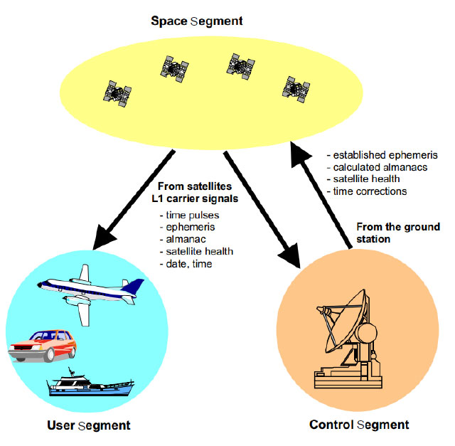

图9-9GPS系统组成由图9-9可知，GPS包含如下三个段。

❑空间段（SpaceSegment，SS）：空间段由GPS卫星组成。

❑控制段（ControlSegment，CS）：控制段用来控制和监视GPS的运行。控制段包括一个主控站（MasterControlStation，位于美国科罗拉多州）​、数个监控站（MonitoringStation）​、地面控制站（GroundControlStation）以及地面天线（GroundAntenna）​。图9-10为目前GPS系统的CS站点分布图。

❑用户段（UserSegment，US）：用户段主要是GPS的使用者。GPS中，用户被分为民用用户（CivilianUsers）和军用用户（MilitaryUsers）两大类。其中，军用用户需要得到相关部门的授权才能获取更高精度的GPS数据。

GPS这三个段将借助GPS规定的通信频段以及数据封装格式进行通信。其中，空间段和控制段能双向通信，而用户段只能从空间段获取数据。

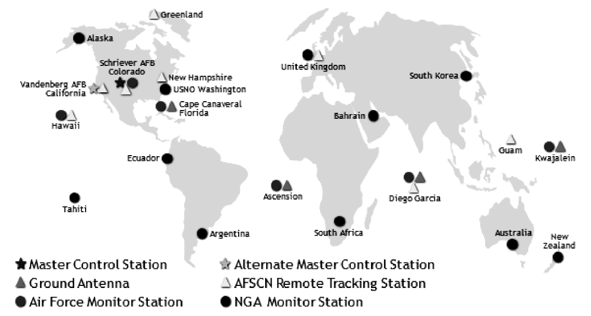

图9-10CS站点分布图说明GPS提供两种类型的服务，分别是标准定位服务（StandardPositioningService，SPS）和精密定位服务（PrecisionPositioningService，PPS）​。其中，SPS主要面向全世界的民用用户，而PPS主要面向美国及其盟国的军事部门以及民用的特许用户。

下面介绍GPS空间段以及GPS通信及数据包方面的知识。

1.GPS空间段GPS空间段的建设历经了30多年的时间。表9-1展示了这期间GPS卫星更新换代的几次重要事件。

[9]表9-1GPS空间段建设大事记

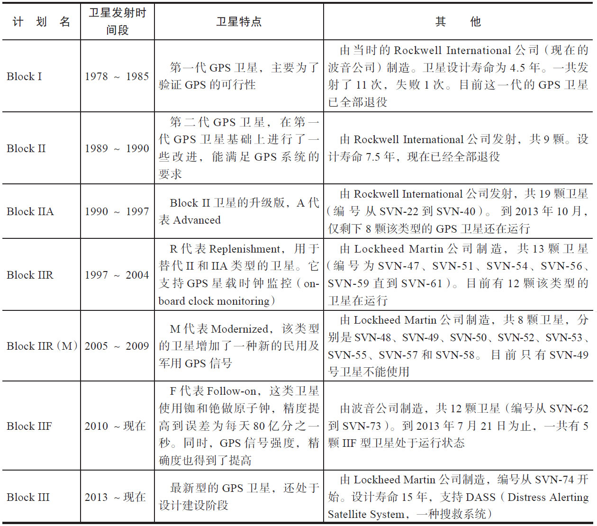

参考资料[10]总结了GPS空间段建造历史以及GPS卫星发射计划。

目前为止，GPS空间段由32颗GPS卫星（卫星的英文名为Satellite，也称为SpaceVehicle，简写为SV）组成，这些卫星分布在6个轨道上，每个轨道与地球赤道面的倾角为55度。GPS卫星轨道高度为20180千米，卫星在轨道上的运行周期大约为12小时。不过，由于地球的自转，人们在地面上观测GPS卫星，在23小时56分左右会回到最初的观测位置。图9-11所示为GPS卫星轨道分布图。

由于每颗GPS卫星的信号只能覆盖地球表面的一部分，所以GPS空间段在设计时就保证任何时候，地球表面任何地方都能被至少4颗GPS卫星信号覆盖。图9-12为某时刻从地面观测到的GPS卫星的位置分布图。

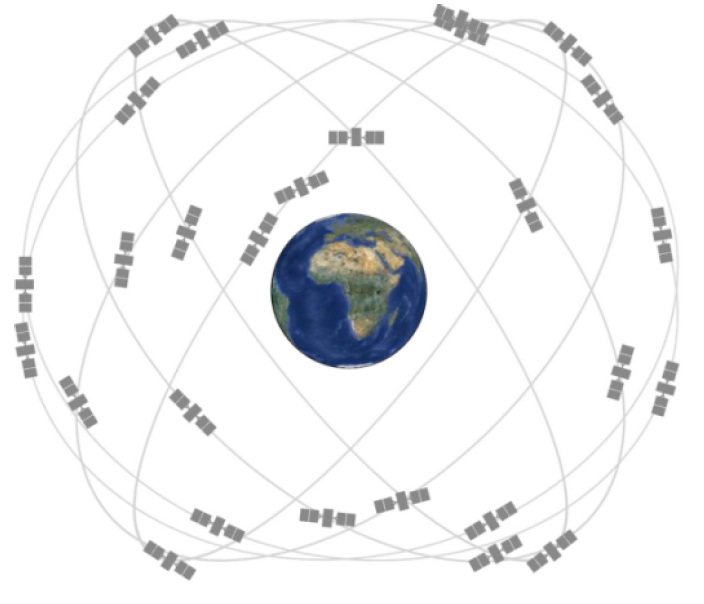

图9-11GPS卫星轨道分布

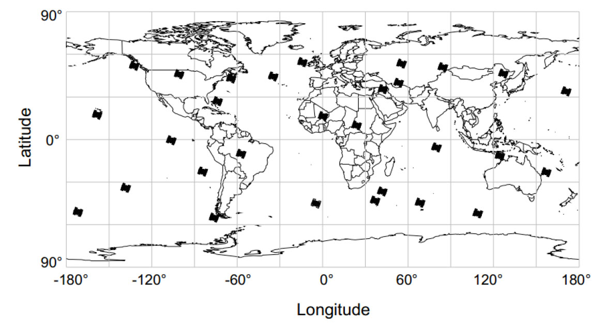

图9-122001年4月14日UTC时间12点整GPS[11]卫星分布图提示为什么要确保至少4颗卫星的信号能覆盖到地球表面任意地方呢？根据前面介绍的测距原理可知，要计算接收器的位置即（x，y，z）坐标值就需要3颗卫星，而由于接收器时钟和卫星时钟的不同步，所以还需要至少一颗卫星用来计算信号传输时间。

综上，GPS定位需要至少4颗卫星参与。

在此推荐使用GpsPredict软件获取和展示GPS卫星轨道及相关信息。图9-13所示为该软件运行时的界面。

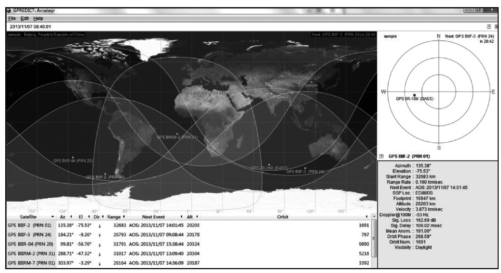

图9-13GpsPredict运行界面提示GpsPredict的软件下载地址为hp://sourceforge.net/projects/gpredict/files/。

2.GPS通信频段GPS卫星和地面监控站以及接收器使用无线电波进行通信，GPS一共使用了三个频段的无线[11]电波来传输数据，如图9-14所示。

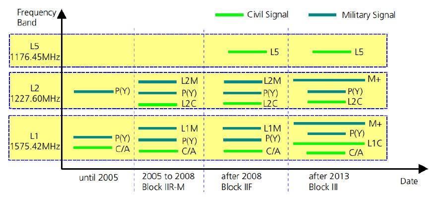

图9-14GPS卫星通信频段GPS一共使用三种频段的无线电波，由于它们都位于无线电频谱的L频段，所以它们分别被称为L1（中心频率1575.42MHz）​、L2（中心频率1227.60MHz）和L5（中心频率1176.45MHz）​。

在2005年之前，GPS卫星使用L2和L1频段的无线电波。其中，L1频段传输两种GPS信号，一个是民用的C/A码（全称是Coarse/AcquisitionCode）​，它代表粗捕获码数据。另外一个是军用的P（Y）码，它代表精测数据（P代表Presice，Y代表数据是加密的）​。L2频段仅传输P（Y）码，即仅供军用。下文还将详细GPS信号方面的知识。

IIR（M）型号的GPS卫星在L2频段上增加了一个名为L2C（C为Civil的意思）的GPS信号。L2C信号可以和C/A信号共同使用（即所谓的双频）以减少大气电离层的影响从而提高定位精度（其精度甚至能超过军用级定位的精度，详情见参考资料[12]​）​。另外，L1和L2频段上新增了针对军用用户的L1M和L2M信号，它们均采用BOC（BinaryOsetCode）方法进行调制和解调，可显著增强军用信号的抗干扰能力。

IIF卫星能在L5上发射民用GPS信号，这类信号主要为航空安全服务，它具有更高的功率，更大的带宽和更稳定的服务。详情见参考资料[13]​。

在L1频段，III型卫星将支持一种名叫L1C的新GPS信号。L1C信号可增强GPS系统和其他GNSS系统（如中国的北斗导航系统也将广播L1C信号）之间的交互性（interoperability）​。

图9-15总结了各类型GPS卫星所支持的通信频段信息。

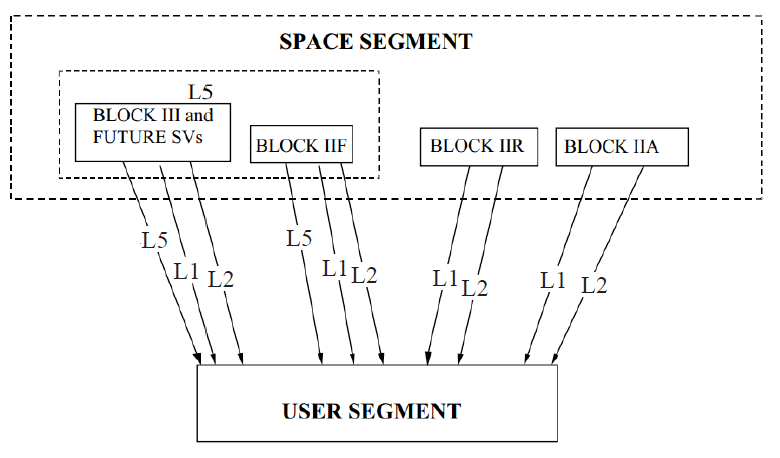

图9-15GPS各类型卫星所支持的通信频段[14]了解了GPS卫星通信频段的知识后，下面让我们把注意力放到GPS卫星通过这些频段所传输的数据上来，即和GPS信号相关的知识点。

[11]3.GPS信号GPS信号将借助上一节所述的GPS卫星通信频段进行无线电传输，它由三部分组成，如图9-16所示。

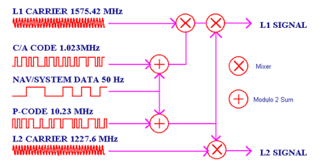

图9-16GPS信号的组成由图9-16可知，GPS信号包含主要三个组成部分。

1）载波：分别是L1和L2（注意，本书不讨论L5的情况，感兴趣的读者可阅读参考资料[14]​）​，其中心频率分别是1575.42MHz和1227.60MHz。

2）测距码（RangingCode）：用来测量卫星和接收器之间距离的一种信号。测距码其实是一种经过精心设计的伪随机噪声（Pseudo-RandomNoise，PRN）​。

GPS有C/A码和P码两种测距码。

❑C/A码（粗捕获码）​，频率为1.023MHz，周期为1ms，码长为1023，码元的宽度为293.05m，测距精度为2m到3m。

❑P码（精捕获码）​，频率为10.23MHz，是和粗捕获码对应的测距码，其周期为7天，码12长为6.1871*10，码元周期0.097752微秒，相应码元宽度为29.3m，测距精度为0.3m。P码供军事应用，故可以对它进行密。

加密后的P码称为“Y码”​。

3）导航电文（NavigationData，也叫D码）：在定位计算时，除了测距码外还需要卫星的一些信息，例如星历、时间等。这些数据封装在GPS导航电文中，其传输频率为50比特每秒（即50Hz）​。导航电文的详情见下节。

C/A码仅在L1频段上发送，而P码同时在L1和L2频段发送，根据前面介绍的双频知识，接收器可通过接收L1和L2频段的P码以消除大气电离层造成的延时影响从而进一步提高定位精度。

注意在数字通信中，一个数字脉冲称为一个码元。一个周期中码元的个数称为码字的长度，简称为码长，常用n表示。

C/A码的码元宽度为293.05m，这是通过以下公式得来。

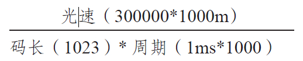

其测距精度是如何计算出来的呢？接收器在工作时会生成一个C/A码，这个C/A码将和某个卫星发送的C/A码进行匹配。匹配时涉及码相位数字信号处理方面的工作，理想情况下其最高精度能达到码元宽度的1%，所以C/A码的测距精度为293.05*1%（约3m）​。

关于GPS信号方面的进一步知识，请读者阅读参考资料[15]​。下面来看看GPS导航电文的内容。

4.GPS导航电文（1）数据格式及内容GPS导航电文（NavigationMessage）有其[11]特定的格式，如图9-17所示。

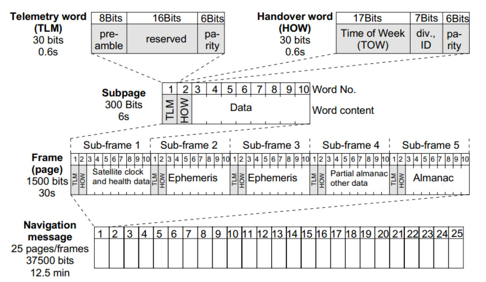

图9-17GPS导航电文格式如图9-17所示，GPS导航电文的基本单位是帧（Frame，也叫Page）​。一帧包含1500比特。导航电文的传输速率是每秒50比特，故传输完整的一帧数据需30s。

每一帧中的1500比特又被平均分配，每300

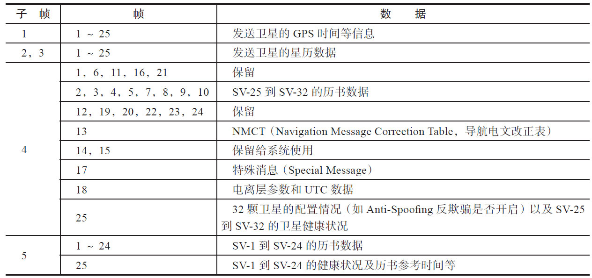

比特组成一个子帧（Sub-Frame）​，所以一帧包含5个子帧。每一个子帧又由10个字码（word）组成，每一个字码包含30位数据。

子帧的第一个字码叫TLM（Telemetry由表9-2可知，所有的25帧数据中，其子帧1Word，遥测码）​，第二个字码叫HOW到子帧3的内容相同。它们都用来描述信号发（HandoverWord，转换字）​。下文将详细射卫星的一些信息。此处特别提醒读者，子帧介绍TLM和HOW的组成。

1～3包含的是某颗卫星自己的GPS时间和星历数据。所以，对地面接收器来说，某颗卫星一个完整的GPS导航电文由25帧组成，共的数据每隔30s（每一帧传输的时间为30s，37500比特，故全部传输完它们共需12.5分而每一帧的前三个子帧都包含了该卫星最新的钟。

信息）就可以得到更新。

表9-2为读者总结了GPS导航电文25帧所包含的数据。

特别注意一个GPS卫星所发送的导航电位包括自己的星历数据以及其他卫星的历书数[16]表9-2导航电文帧数据内容据。

[16]现在来看TLM和HOW的内容，如图9-18所示。

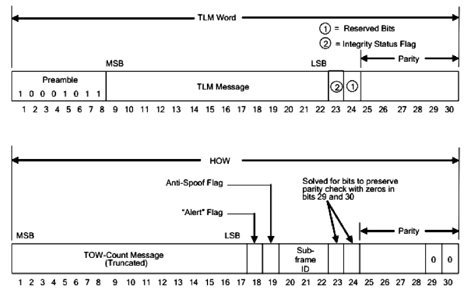

图9-18TLM和HOW的构成图9-18中，TLM前8位（Preamble，也叫前导码）由用于同步的二进制数10001011开始。其第9～22位为TLM消息，供PSS用户及控制段和空间段使用。第23位为完整性状态标志（IntegrityStatusFlag，ISF）​，第24位保留，最后六位是奇偶校验码。

HOW前17位用于传输星期时间（TimeoftheWeek，TOW）​，第18位为警告（Alert）标志，该值为1时将提醒SPS用户测量精度较差。第19位为反欺骗（Anti-Spoof，A-S）标志，该值为1表示A-S功能开启。20到22位为子帧的ID（一个帧中包含五个子帧，子帧的ID从1开始编号）​。最后几位用于奇偶校验。

（2）星历和历书星历和历书的内容如表9-3所示。

表9-3星历和历书所包含的参数

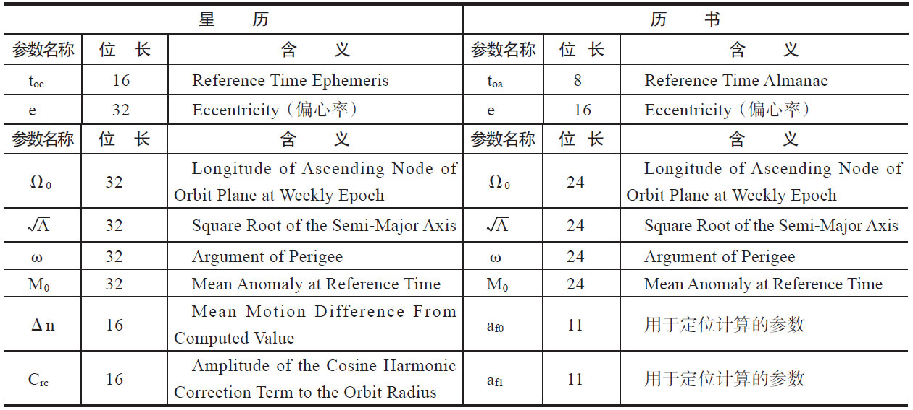

注意，表9-3中仅包含了星历和历书全部参数项的一部分。完整的星历和历书参数定义见参考资料[16]的Table20-III和Table20-VI。另外，从上表中读者也会发现，对于同样的参数

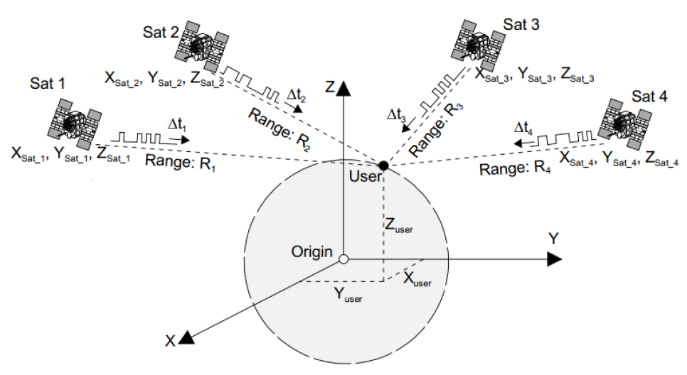

而言，其在历书数据中的精度要比它在星历数据中的精度低（即参数的位长较短）​。

提示为了避免翻译不准带来的误解，表9-3图9-19GPS定位计算原理中的参数含义说明直接使用了其在官方文档中的英文说明。参考资料[16]也有数学公式图9-19中，接收器的位置由（X，user描述这些参数的作用。

Y，Z）表示。

useruser5.定位计算相关知识GPS卫星的位置由（X，Y，Sat_iSat_iZ）唯一确定（[1注7意]，接收器可根据卫星（S1a）t_i定位计算原理的星历等参数信息将卫星在ECI坐标系的值转本节将介绍GPS定位计算相关的知识。在“测换成ECEF坐标系的值）​。GPS卫星发送的距原理介绍”一节中我们曾提到说要计算三维GPS信号到达接收者所用的传输时间由Δt表i坐标系中接收器的位置需要三颗GPS卫星，而示。这样，每个GPS卫星到接收器的距离就可为了解决接收器和GPS卫星时钟的不同步问以计算出来。图9-19中，该距离由R表示。

i题，则需要第四颗GPS卫星参与计算。图9-19展示了定位计算的原理图。

现在来考虑GPS卫星与接收器的时间误差问题。借助高精度的原子时钟以及地面控制站的监控与修正，可以认为GPS卫星之间的时钟是同步。这样，GPS卫星和地面接收器的时间误差就可以用一个参数来表示了。

基于上述内容，得到公式三。

[公式三]Δt=Δt+Δtmeasured0PSR=Δt·c=（Δt+Δt）·cmeasured0PSR=R+Δt·c0Δt为接收器的时间误差，Δt为真实的信号传0输时间，Δt为接收器的GPS信号传measured输时间。PSR为伪距（pseudorange）​。R为GPS卫星到接收器的距离。

显然，在三维笛卡尔坐标系中，R的值可由下面的公式计算得到。

最终，我们可得到一组方程式，见公式四。

[公式四]以图9-19为例，上述公式的i从1～4。

如何计算上述方程组呢？一种常用的方法是通过泰勒级数将其线性化，然后再借助偏微分方程求解。图9-20展示了该方法的原理。

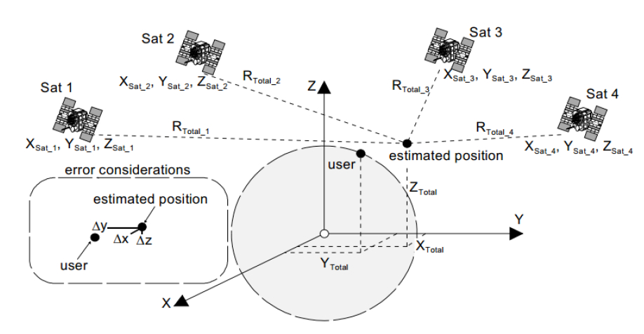

图9-20公式四求解原理如图9-20所示，一个新的位置点被引入，该位置点叫估算位置点（EstimatedPosition）​。GPS卫星离该位置点的距离由R表示。

Total_i估算位置点离接收器真实的位置之间有一段距离，二者坐标的差别由公式五表达。

[公式五]X=X+ΔxuserTotalY=Y+ΔyuserTotalZ=Z+ΔzuserTotalX为接收器的X坐标，X为估算点的XuserTotal坐标，二者的差值为Δx。

经过一系列的公式替换和变量求偏导，可得到图9-21所示的矩阵。

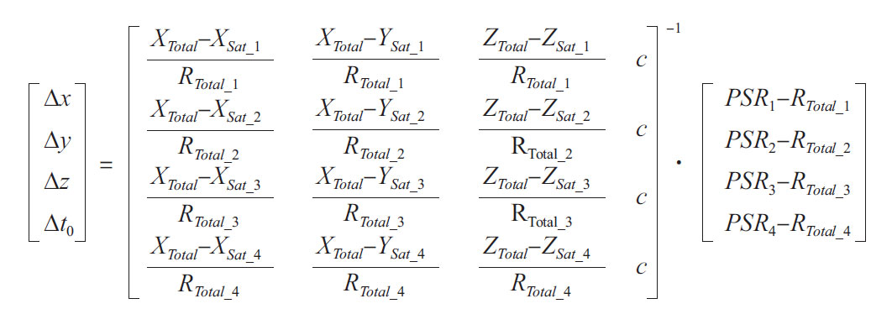

图9-21GPS定位矩阵计算公式接收器将利用图9-21所示的公式进行迭代计算，直到图左边的Δx等参数值小于期望误差（如0.1m）为止。然后，接收器的位置可通过公式五和根据图9-21中得到的Δx等值计算出来。

注意除了计算接收器的坐标位置外，GPS还能计算出接收器的移动速度，这是基于多普勒效应来实现的。以GPS为例，多普勒效应就是当GPS卫星与接收器之间存在相对运动时，接收器一端收到的GPS信号的频率和GPS卫星实际发送的信号的频率并不相同，二者之差称为多普勒频移。由于GPS卫星的速度可根据其导航电文中的信息推算出来，故接收器根据多普勒频移的相关公式就很容易计算出自己的移动速度了。关于GPS测速方面的知识，可阅读参考资料[18]​。

[17]（2）DOP介绍上一节介绍了GPS定位计算的原理。在真实环境中，GPS定位计算中还存在某些误差，这些误差的原因大体由如下几个部分组成。

❑卫星时钟：虽然卫星时钟的精度已经很高了，但由于光速的值很大，这就造成时间上10ns的偏差都会造成距离上3m的误差。

❑卫星本身的轨道位置：卫星在轨道上的位置精度在5m左右。

❑光速：GPS信号从太空中的卫星到地面接收器传输时其速度不是固定值，而是会受到电离层和对流层的影响。

❑接收器的时钟：接收器的时钟和卫星时钟不同步，这也会造成相应的误差。

❑GPS信号的多路径效应：GPS信号传输过程中常会因为建筑物或其他反射物发生反射。显然，这些反射信号的传输时间比没有反射的信号的传输时间要长，这就给接收器测距时造成一定的误差。

参与定位计算的GPS卫星的空间分布也会对最终计算结果有较大影响。本节重点介绍它。

如上，本节重点关注GPS卫星空间分布情况对定位计算的影响。在GPS系统中，因卫星的空间分布造成的测距误差可用DOP（DilutionOfPrecision，精度衰减因子）等一组值来描述，这一组值如下。

❑GDOP（Geometric-DOP，几何精度衰减因子）​：描述卫星空间分布情况对位置计算和时间测量的影响。

❑PDOP（Positional-DOP，位置精度衰减因子）​：描述卫星空间分布情况对位置计算的影响。

❑HDOP（Horizontal-DOP，水平精度衰减因子）​：描述卫星空间分布情况对水平位置（二维空间）位置计算的影响。

❑VDOP（Vertical-DOP，垂直精度衰减因子）​：描述卫星空间分布情况对高度计算的影响。

❑TDOP（Time-DOP，时间精度衰减因子）​：描述卫星空间分布情况对时间测量的影响。

从上述各项DOP的描述可知，卫星空间分布的情况将影响定位计算的精度，这是为什么呢？来看图9-22的DOP原理。

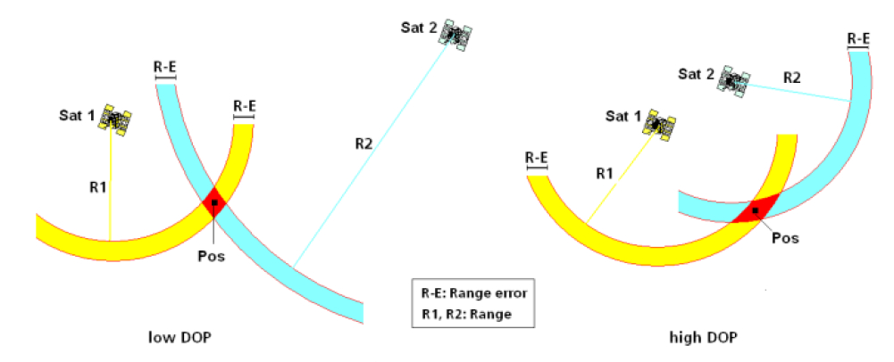

图9-22DOP原理左图中，Sat1和Sat2这两颗卫星相距较远，而右图中Sat1和Sat2两颗卫星相距较近。

计算接收器Pos的位置时，Sat1和Sat2的测距都会存在一定的测距误差。每个卫星测距所造成的误差由图中的圆环表示。根据9.2.1节对测距原理的介绍，Pos的位置位于两个圆环的重合区域之中。

很明显，左图中Pos所在的重合区域面积较小，而右图中Pos所在的重合区域面积较大。

这说明左图的测距误差比右图的测距误差小。

所以，左图卫星分布区域情况对应的DOP值较小，而右图的DOP较大。

提示根据DOP的取值情况，定位测量的质[15]量可划分为4个级别。质量非常高：

DOP值为1～3。质量高：DOP值为4～5。

质量一般：DOP值为6时。质量差：DOP值大于6时。

关于DOP更详细的信息，可进一步阅读参考资料[17]​。

（3）首次定位时间首次定位时间（TimeToFirstFix，TTFF）是衡量GPS接收设备性能的一个重要指标，它描述的是GPS接收器需要花费多长时间来捕获GPS卫星信号直到计算出自己的位置。目前，[19]TTFF因启动模式不同而有所区别，这些启动模式分别如下。

❑冷启动模式（也叫出厂模式）​：在这种模式下，GPS接收器没有保存有效星历、时间及位置等信息，所以它需要从周围可搜索到的GPS卫星那接收信号并获取用于定位的数据（星历、历书、时间等信息）​。前面曾介绍，传输一个完整的GPS导航电文需要12.5分钟。在这种模式下，TTFF至少为12.5分钟。

❑暖启动模式：在这种模式下，GPS接收器保存有历书数据（不超过180天）​、旧时间信息（不超过20秒）及旧位置信息（不超过100千米范围）​，但星历数据失效（超过4小时）​。

如此，在计算位置时，GPS接收机需要从GPS卫星那接收星历数据（读者还记得吗，导航电文的25个帧中第2、3子帧包含发送卫星的星历数据，由于每一帧发送时间为30秒，所以星历数据每隔30秒就会更新一次）​。所以，在这种模式下，TTFF至少为30秒。

❑热启动模式：在这种模式下，GPS接收机具有有效星历数据、时间及位置等信息，这样，GPS接收器就无须解码GPS导航电文中的星历数据，它只要利用GPS信号进行测距计算就可以了。热启动模式下，TTFF速度很快，能做到10秒以内。

显然，减少TTFF对提升用户的使用体验有极大的帮助。根据上述内容可知，TTFF的瓶颈主要在星历、历书数据等信息的获取上。为了解决此问题，人们设计了AssistedGPS（辅助GPS）方法。AGPS使得GPS接收机能通过移动通信网络（如2G/3G等，传输速度远超GPS卫星信号的传输速度）下载星历数据等信息，从而加快首次定位时间。关于AGPS的内容，请读者阅读9.2.2节。

提示如果确实需要接收和解析GPS卫星信号，多通道接收方法可用来同时接收多个卫星的信号从而提升TTFF。关于这一点见参考资料[20]​。

6.NMEA-0183和GPX本节将介绍和GPS相关的两种数据文件格式，先来看NMEA-0183。

[21]（1）NMEA-0183NMEA-0183是美国国家海洋电子协会（NationalMarineElectronicsAssociation，NMEA）为海用电子设备制定的标准格式。GPS接收机可按照该标准定义的格式输出诸如定位时间、纬度、经度、高度、定位所用卫星数、DOP值等很多信息。

提示NMEA-0183的输出内容由ASCII字符组成。简单点说，可以用文本软件来查看和修改NMEA数据。

NEMA文件的内容由一条一条的语句组成，每一条语句都有对应的类型，表9-4列举了其中一些常用语句的类型以及它们所包含的数据信息。

表9-4NMEA的语句类型

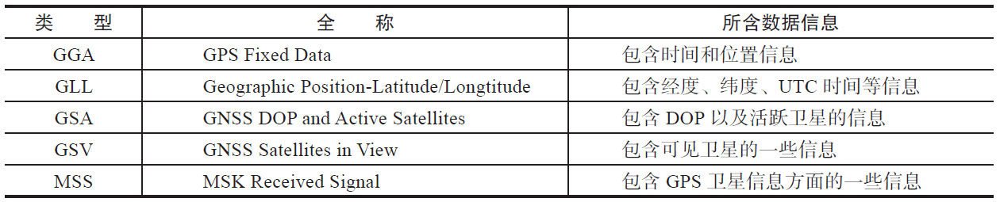

下面我们来看一个NMEA语句示例。

[NMEA语句示例]

```
$GPGGA，161229.487，3723.2475，N，12158.3416，W，1，07，1.0，9.0，M，18.0，M，50，0000*18＜CR＞＜LF＞
```

上面这条NMEA语句中各项信息的含义如表9-5所示。

表9-5NMEA示例解释

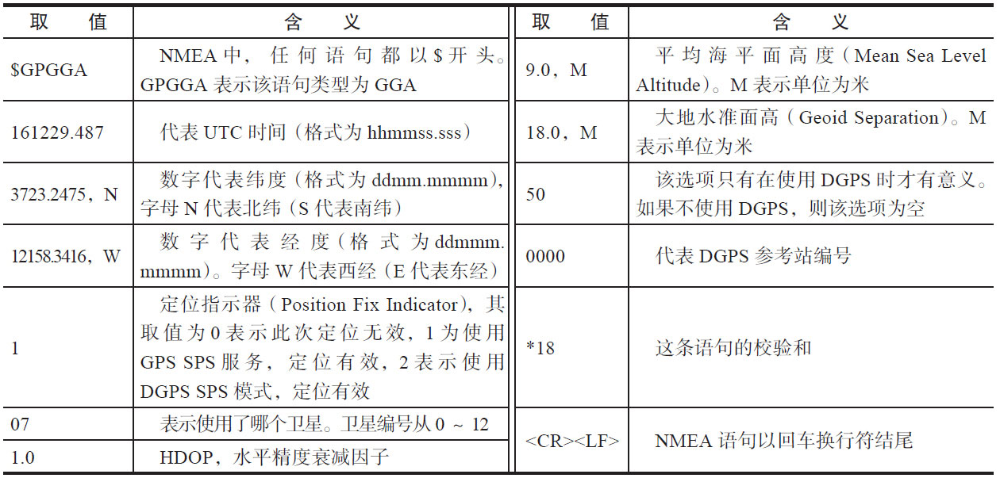

```
  ＜?xml version="1.0" ?＞
＜!-- GPX文件中，gpx标签是根节点-- ＞
＜gpx version="1.0" creator="ExpertGPS 1.1 - http://www.topografix.com"
        xmlns:xsi="http://www.w3.org/2001/XMLSchema-instance"
        xmlns="http://www.topografix.com/GPX/1/0"
        xsi:schemaLocation="http://www.topografix.com/GPX/1/0
        http://www.topografix.com/GPX/1/0/gpx.xsd"＞
  ＜!-- time标签代表该文件的创建时间--＞
  ＜time＞2002-02-27T17:18:33Z＜/time＞
  ＜!-- bounds标签用来描述该文件中所有经度和纬度的最大及最小值  --＞
  ＜bounds minlat="42.401051" minlon="-71.126602" maxlat="42.468655"
         maxlon="-71.102973" /＞
  ＜!--  wpt为waypoint的简称，代表某个位置点--＞
  ＜wpt lat="42.438878" lon="-71.119277"＞
       ＜!-- ele描述该点的海拔，单位为米  --＞
        ＜ele＞44.586548＜/ele＞
        ＜!-- wpt下的time标签表示创建或修改整个wpt标签的时间，为UTC时间  --＞
        ＜time＞2001-11-28T21:05:28Z＜/time＞
        ＜name＞5066＜/name＞＜!--name表示该wpt的GPS名（GPS name of this wpt） --＞
        ＜sym＞Crossing＜/sym＞＜!--sym表示该wpt的GPS符号名（Symbol name）＞
＜/wpt＞
 ＜!-- 其他的wpt元素  --＞
＜!--  rte代表一条路径，它按顺序记录了这条路径中的关键位置点--＞
＜rte＞
         ＜name＞BELLEVUE＜/name＞  ＜!-- rte的name标签表示路径名--＞
         ＜number＞1＜/number＞ ＜!-- number表示路径编号--＞
      ＜!-- rtept：其实就是wpt，只不过在rte标签中叫rtept--＞
      ＜rtept lat="42.430950" lon="-71.107628"＞
          ＜ele＞23.469600＜/ele＞
          ＜time＞2001-06-02T00:18:15Z＜/time＞
          ＜name＞BELLEVUE＜/name＞
          ＜cmt＞BELLEVUE＜/cmt＞  ＜!-- cmt是comment的缩写，其作用类似于备注说明--＞
          ＜sym＞Parking Area＜/sym＞
      ＜/rtept＞
  ＜!-- 其他的rtept元素  --＞
＜/rte＞
＜/gpx＞
```

NMEA的介绍就到此为止。更详细的信息请阅读参考资料[21]​。

[22]（2）GPX和NMEA不同，GPX（GPSeXchangeFormat）将GPS数据封装在XML文件中，所以它遵循XML相关的语法。GPX比较简单，通过一个例子来介绍。

[GPX示例]上述例子展示了GPX文件格式中的一些主要构成部分。GPX中有三个比较重要的概念。

❑Waypoint：路点，由＜wpt＞标签标示，代表一个感兴趣的点或者地图上的某个点。

wpt英文解释为"wptrepresentsawaypoint，pointofinterest，ornamedfeatureonamap"。

❑Route：路径，由＜rte＞标签标示。路径由一组有序的路点构成。rte的英文解释为"rterepresentsroute-anorderedlistofwaypointsrepresentingaseriesofturnpointsleadingtoadestination"。注意，在Route中，wpt是转向点（turnpoints）​。

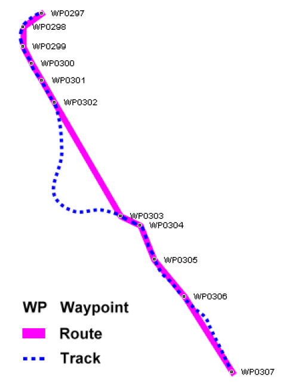

❑Track：轨迹，由＜trk＞标签标示。用于记录某人从源地址到目标地址所走过的那些路点。Track的英文解释为"representsatrack-anorderedlistofpointsdescribingapath"。

Track和Route的区别很微妙，二者关系如图9-23所示。标有WP字样的点为Waypoint。

源地址的路点为WP0297，目标地址的路点为WP0307。

图9-23Track和Route图中的实线表示路径，而由路点组成的那条曲线就是轨迹。轨迹记录了某人在某个时间段从源到目标所经过的那些WP。所以在GPX文件的轨迹标签内所列出的WP同时还会记录此人经过该点时的时间信息。

和轨迹略微不同，路径表示从源点达到目标点之间的一些关键点。

提示参考资料[23]描述的Track和Route的区别似乎和GPX官网所给示例（本节所分析的GPX实例就来自于GPX官网）不同。其中，路径点和是否有人在某时刻途经过它没有关系，路径点天然就存在，所以不含时间戳信息（时间信息描述的就是人们在什么时刻达到过此处）​。但是本节的GPX实例中路径点却包含了时间戳信息，并且官方对路径中路点的描述是"turnpoint"，其英文解释是"apointatwhichthereisachangeindirectionormotion"。

除了GPX外，还有一种名为KML的文件格式被谷歌地球和谷歌手机地图等软件使用。

KML（KeyholeMarkupLanguage）最初由Keyhole公司开发，是一种基于XML标准的格式。KML可描述点、线、图像等多种地理信息。Android的DDMS也支持KML。

注意请读者自行研究KML的知识，相关资料见参考资料[24]​。

7.GPS增强系统为了提升GPS定位的精确度和易用性，人们还设计了一些GPS增强系统，这些增强系统大体可分为如下几种。

❑DGPS（DifferentialGlobalPositioningSystem，差分GPS）​，用于提高GPS的定位精度。

❑SBAS（Satellite-BasedAugmentationSystem，星基增强系统）​，用于提高GPS定位精度以及可靠性。

❑AGPS（AssistedGPS，辅助GPS）​，通过从移动网络下载星历等数据以提升GPS定位速度。

❑HSGPS（HighSensitivityGPS，高精度GPS）​，用于提升GPS接收器的灵敏度。

下面介绍DGPS、SBAS以及AGPS的内容。

注意关于HSGPS见参考资料[25]​。

[25]（1）DGPS和SBAS在介绍DOP时曾提到过GPS定位计算时的一些误差，而DGPS以及SBAS的目标就是减少这些误差所带来的影响。SBAS和DGPS有一定关联，所以我们先来看DGPS，其工作原理如下。

❑为了减少（或者修正）定位计算的误差，人们事先把GPS接收机放在位置已精确测定的点上，这些点叫基站。基站的接收机通过接收GPS卫星信号，测得并计算出它们到卫星的伪距，将伪距和已知的精确距离相比较，求得该点在GPS系统中的伪距测量误差。

❑然后这些基站再将这些误差作为修正值以标准数据格式通过播发台向周围空间播发。

❑在基站附近的DGPS用户一方面接收GPS卫星信号进行测距，同时它接收来自基站的误差修正信息，并以此来修正定位结果，从而提高定位精度。

DGPS用户离基站多远才算附近呢？下面有两[15]个参考距离。

❑如果使用伪距差分定位（CodeDifferentialPositioning）技术，则DGPS和基站的距离最好在200千米以内。

❑如果使用载波相位差分定位（Carrier-PhaseDifferentialPositioning）技术，则DGPS和基站的距离最好在20千米内。

如上所述，基站负责将修正数据以标准格式向周围空间播发。为此，人们也制订了一些协议来规范化这一工作。这些规范以及它们的优缺点如表9-6所示。

表9-6DGPS修正数据传输方法介绍

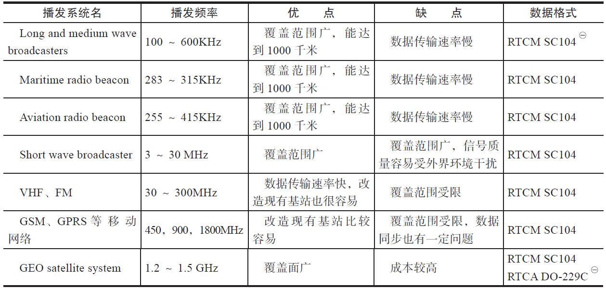

㈠RTCM（RadioTechnicalCommissionforMaritime，国际海运事业无线电技术委员会）​。SC104（SpecialCommittee104）

定义了DGPS修正数据的格式。

㈡RTCA（RadioTechnicalCommissionforAeronautics，航空无线电技术委员会）​，DO-229C是为它指定的一个标准。

由上表可知，修正数据的格式主要分为RTCMSC104和RTCADO-229C两种。当修正数据用卫星发送时，这种系统就叫SBAS。SBAS使用的协议格式为RTCADO-229C。

当然，SBAS的功能远不止简单地播发修正数据，它还能监测GPS或其他GNSS卫星的情况以加强信号的可靠性和安全性。图9-24展示了目前几个已投入使用或在建的SBAS系统以及它们的覆盖范围。

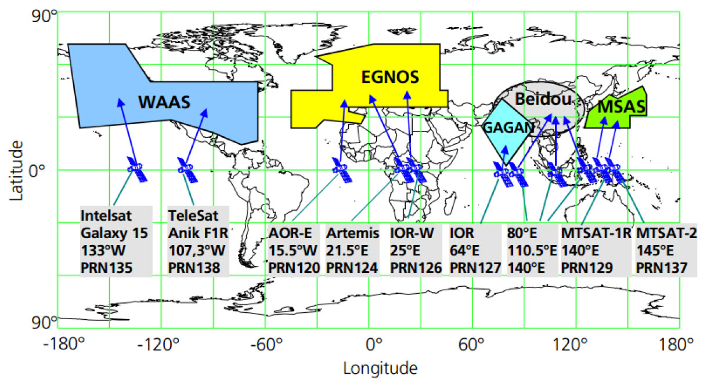

图9-24SBAS系统图9-24中几个主要的SBAS从左至右分别如下。

❑WAAS：美国建造的广域增强系统（WideAreaAugmentationSystem）​。

❑EGNOS：欧盟建造的欧洲静地导航覆盖服务（EuropeanGeostationaryNavigationOverlayService）​。

❑GAGAN：印度建造的地球同步轨道增强导航系统（GPSAndGEOAugmentedNavigation）​。

❑Beidou：中国建造的北斗导航系统。

❑MSAS：日本建造的多功能卫星增强系统（MultifunctionalSatelliteAugmentationSystem）​。

虽然每个单独的SBAS只能覆盖一定的范围，但通过RTCADO-229C协议，SBAS之间的数据能够保证兼容性。

（2）AGPSAGPS的作用很简单，就是在没有有效星历数据等定位计算所需信息的情况下（或者在GPS信号不好甚至没有GPS信号的环境中）​，使得GPS接收器能通过别的方式获取所需信息以加快定位速度。AGPS的原理如图9-25所示。

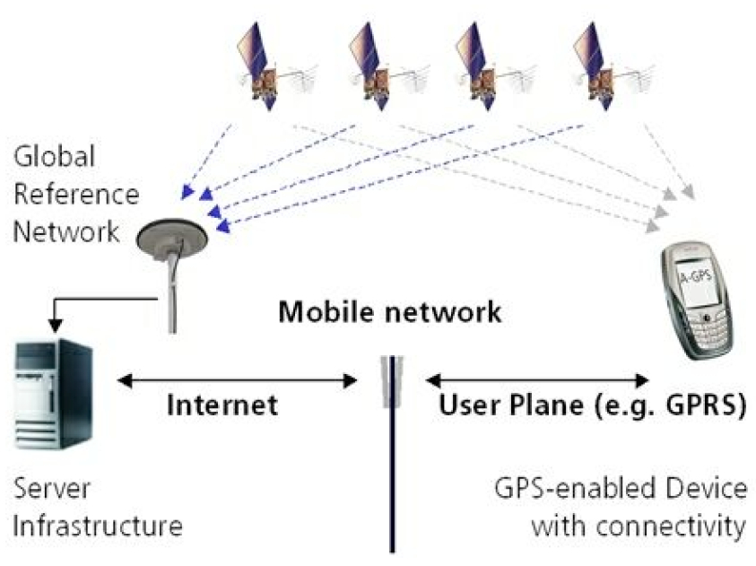

图9-25AGPS原理如图9-25所示，AGPS是一个比较复杂的系统，它首先需要在全球建造一个用于收集GPS卫星数据的参考网络（GlobalReferenceNetwork）​。目前比较知名的参考网络由IGS（InternationalGNSSService）组织建造，它在全球80多个国家设有300多个GPS卫星跟踪站。IGS的官方网站（hp://igscb.jpl.nasa.gov/）提供GLONASS和GPS的卫星数据下载服务。

AGPS将收集到的这些数据（一般称为辅助数据，AidingData）保存在服务器上并对外界提供下载。例如图9-25中，支持AGPS的手机就可以通过移动通信网络发起相关请求以获得这些辅助数据从而加快自己的定位速度。

以上是对AGPS原理非常简略的介绍。在AGPS的实现细节中，还有如下几个比较重要的知识点。首先是UserPlane和ControlPlane的概念，这两个词源自移动通信领域。

❑ControlPlane用于在手机和基站间传输控制信息，例如手机收到一个来电信号就是通过ControlPlane传输的。

❑UserPlane主要用来传送数据包（例如TCP/IP、HTTP等）​。我们用的3G或GPRS上网就是UserPlane。显然，手机通过UserPlane来获取AidingData这种方式更具通用性和扩展性，例如它能通过TCP或UDP等协议来传输数据。关于CP和UP的区别，见参考资料[26]​。

手机如何利用AGPS来进行定位呢？AGPS可分为MSB（MobileStationBased）和MSA（MobileStationAssisted）两种运行模式。

❑MSB模式下，手机从AGPS位置服务器上下载辅助数据，然后手机再结合GPS卫星信号进行定位计算。这种方式需要手机下载辅助数据，同时它还需要利用其自身的CPU、内存等资源进行最终的定位计算。MSB模式的优点是网络负担小且定位延时小，适合短时间内的连续定位。

❑MSA模式下，手机接收并解调GPS卫星信号，然后将这些伪距信息传给AGPS位置服务器。AGPS位置服务器根据手机所发送的数据、自己所保存的卫星数据以及其他一些信息（例如手机当时通信的基站位置）计算出手机所在位置，然后将该信息返回给手机。MSA模式下，手机无须使用自己的CPU等资源来进行定位计算。MSA的优点是对终端的性能要求低，但其定位的延时大，不适合高速行驶情况下的定位。

提示如果接收器只使用GPS卫星信号进行定位，这种工作模式称为Standalone（也叫Autonomous）模式。MSA或MSB都需要手机接收GPS卫星信号。对于无法接收GPS卫星信号的地区（如办公室等）该怎么办呢？这就需要借助其他方法了，例如Ce-ID定位方法，其原理很简单，就是通过获取目标手机所在的蜂窝小区ID来确定其所在的位置。

AGPS涉及的内容非常多，为了更规范地为用户提供AGPS服务，OMA（OpenMobileAlliance，开放移动联盟）制定了一整套服务和标准，这套服务和标准统称为OMA-SUPL（SecureUserPlaneLocation）​。了解OMA-SUPL的工作流程非常有助于理解本章下文对Android平台中AGPS相关的代码分析。

[27]​[28]9.2.3OMA-SUPL协议OMA-SUPL包含一套非常复杂的协议，它综合了移动通信领域现有的一些标准和协议（如3GPP相关协议、WAP等）​，其目的是充分利用移动网络的相关特性以为用户提供更好的位置服务。OMA-SUPL目前最新版本是3.0，表9-7列举了OMA-SUPL各版本的特点。

表9-7OMA-SUPL各版本特点

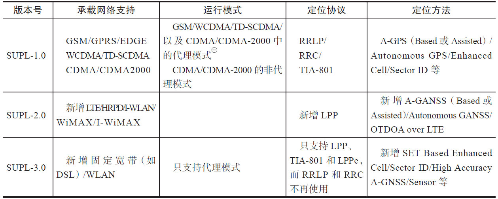

㈠关于代理模式和非代理模式的区别，请参考9.2.3节SUPL架构。

表9-7中的缩写词含义如下。
