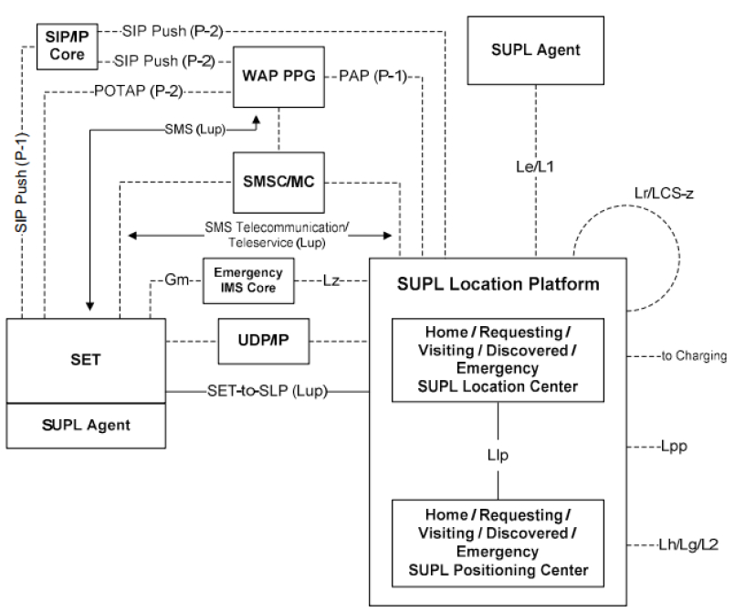
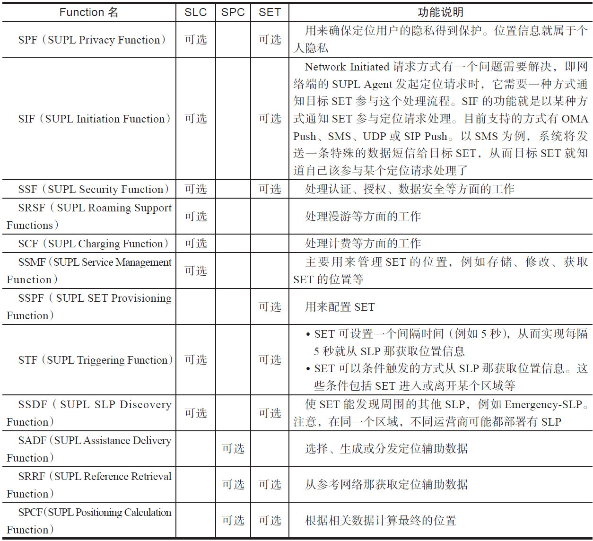
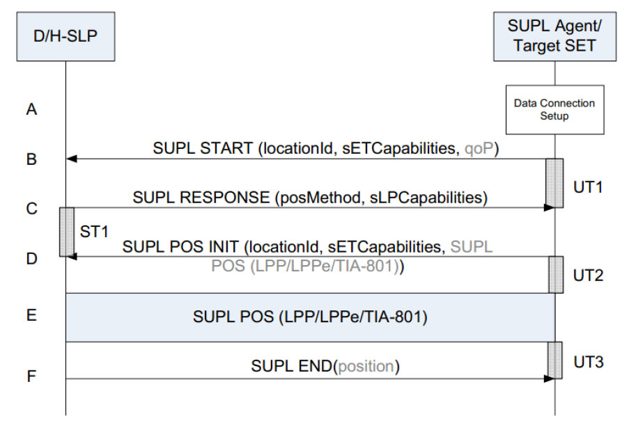
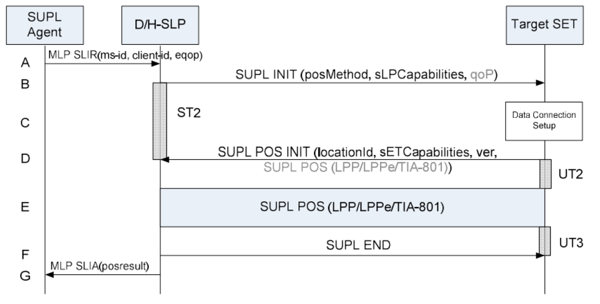

# 9.2.3 OMA-SUPL协议[27][28]

❑RRLP（RadioResourceLCSProtocol）是一种协议，LCS是LocationServices的缩写。

❑RRC（RadioResourceControl）是一种协议。

❑LPP（LTEPositioningProtocol）是基于LTE的定位协议。

❑LPPe（OMALPPExtensions）是LPP扩展协议。

❑TIA（TelecommunicationsIndustryAssociation）是美国电信工业协会。

❑OTDOA（ObservedTimeDifferenceofArrival）是一种移动定位技术。

提示OMA-SUPL涉及很多来自移动通信领域的概念和词汇。由于篇幅问题，笔者不打算对它们进行深入介绍，感兴趣的读者可自行研究。

1.SUPL架构OMA-SUPL是一个比较复杂的系统，图9-26所示为它的架构。

图9-26SUPL架构图9-26中主要包含三个部分。

❑左下方的SET代表AGPS服务的客户端，例如我们的Android智能手机。在规范中，SET全称是SUPLEnabledTerminal（终端）​。

❑右下方的SLP（SUPLLocationPlatform）包含两个重要组成部分，一个是SLC（SUPLLocationCenter）​，其作用是和SET交互，例如处理来自SET的请求；另外一个是SPC（SUPLPositioningCenter）​，其作用是进行定位计算。如果SET直接和SPC交互，则称为非代理工作模式。相反，如果SET借助SLC与SPC交互的话，则称为代理模式[29]。SUPL3.0版协议只支持代理模式，故SET将只能和SLC交互。

❑右上方的SUPLAgent，是一个需要获取位置信息的应用程序。SUPLAgent可以运行在SET中（如图中左下方的SET和SUPLAgent）​，也可以运行在SUPLNetwork中，如图中右上方单独绘制的SUPLAgent。

不论哪种情况，定位请求只能由SUPLAgent发起。如果SUPLAgent在SET中，这种请求方式叫SETInitiated请求（终端始发定位请求）​[29]​。如果SUPLAgent位于SUPLNetwork中，则这种请求方式叫NetworkInitiated请求（网络始发定位请求）​。

除了上述三个部分外，图9-26中的连线用于表示它们之间交互所使用的协议等信息。

对于网络始发定位请求而言，SLP需要通知目标SET参与定位工作（而在终端始发定位请求中，请求的发起者与SET在一个设备上）​，这个流程也叫SUPLINIT。SUPLINIT支持的协议很多，例如通过SIP、WAP、SMS等，或者直接利用UDP、TCP等。在使用SIP、WAP或SMS等协议时还需要借助移动通信领域中现有的组件（如SMS需要先通过短信息中心

SMSCenter来处理）​，所以图中也绘制了这些必要的组件以及这些组件和SLP交互的协议，如SMSC、SIP/IPCore、WAPPRG（WirelessApplicationProtocolPushProxyGateway）​、PAP（PushAccessProtocol）​、POTAP（PushOverTheAirProtocol）等。SET和SLP交互的流程由ULPSUPL的内容非常多，不过和本章后文代码分（UserLocationProtocol，下节将详细介绍析相关的内容大多集中在ULP协议即工作流程它）描述。

上。下面来看看ULP。

在SLP中，SLC和SPC交互的协议叫ILP2.ULP介绍（InternalLocationProtocol）​。

ULP主要描述SET和SLP之间该如何交互以完OMA-SUPL还为SET、SLC和SPC定义了一组成定位请求。根据上一节对SUPLAgent的介Function来描述它们应该具有的功能，表9-8绍，ULP的使用分为两大类。

列举了这些Function的名称和功能。

❑SUPLAgent位于SET中，由于定位请求只表9-8OMA-SUPL功能定义能由SUPLAgent发起，所以在ULP中，它被

称为SETInitiated定位请求。其典型的使用案例就是在Android手机中打开导航类应用，这将触发手机发起一次定位请求。

❑SUPLAgent位于SUPLNetwork中，这种情况称图为9N-2e7twSoErTkInInitiitiaateteddU定LP位流请程求。例如，某些网络服务需要跟踪SET的位置，就会1）SET首先和SLP建立数据链接。为了保证数使用这种方式。不过，笔者目前没有找到与之据的安全性，这个链接需要基于TLS相关的典型使用案例，有知晓的读者不妨与大（TransportLayerSecurity，传输层安家分享相关知识。

全）​。图中的D/H-SLP为Discovered/Home-SLP的缩写，H-SLP即这两大类ULP应用场景对应的工作流程各不相同SE，T所我在们运先营来商看所最建常立见的的SSLEPT，I而nitDa-tSeLdP请为求SE的T搜索到的SLP。

工作流程。

2）SET发送SUPLSTART命令给SLP，该命令（1）SETInitiatedULP工作流程携带了一些参数，包括locationId（如果使用图9-27描述了SETInitiatedULP的工作流移动通信网络，则该参数包括基站的Ce程。

Info。如果使用Wi-Fi，则该参数包括AP的信息）​、sETCapablilities（SET的能力，如支持的定位数据封装协议、支持的定位方法等，详情可参考表9-7）​。

3）SLP回复SUPLRESPONSE命令给SET。

RESPONSE命令包含了SLP支持的定位方法（由posMethod表示）​，以及SLP支持的定位能力（由sLPCapabilities描述）​。

4）SET发送SUPLPOSINIT命令给SLP，该命令包含了SET的初始位置等信息。

5）接着，SET和SLP通过一个或多个SUPLPOS消息来计算位置。根据AGPS使用的模式（MSB或MSA）​，位置的计算方法也不尽相同。

6）当位置计算完毕后，SLP发送SUPLEND命令给SET，二者随后断开TLS链接。

提示关于ULP各消息所包含的参数信息，请读者自行阅读参考资料[28]​。

（2）NetworkInitiatedULP工作流程图9-28所示为NetworkInitiated（NI）ULP的工作流程图。

图9-28NetworkInitiatedULP流程图9-28中，由于SUPLAgent位于SUPLNetwork，所以它和SLP的交互遵守MLP（MobileLocationProtocol）​。SLP收到SUPLAgent的SLIR（StandardLocationImmediateRequest）请求后，它将发送SUPLINIT命令给SET。此处需强调，如果SET和SLP此时还没有建立数据链接，SUPLINIT将通过OMAPush消息或数据短信等方式发送给SET，SET收到SUPLINIT命令后将和SLP建立数据链接。

此后，SLP和SET之间的交互与图9-27类似。

SLP最终通过SLIA（StandardLocationImmediateAnswer）将定位信息发送给SUPLAgent。

提示此处不再详述ULP的细节，请读者自行阅读参考资料[28]​。

至此，本章所涉及的GPS相关基础知识就全部介绍完毕。相信读者能感觉到这些内容背后的专业知识是多么庞大和复杂。在此，希望立志成为GPS专家的读者继续保持谦虚的态度，认真学习，争取为中国的北斗导航系统添砖加瓦。

提示本节所述内容能覆盖AndroidGPS相关模块（不含驱动及芯片底层模块）代码中80%左右的背景知识。
