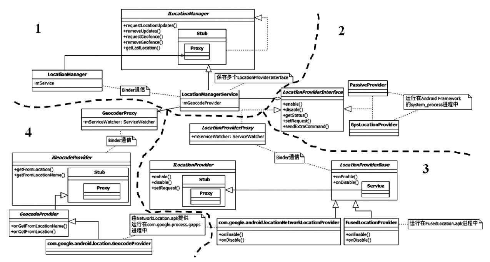

# 9.3.1 LocationManager架构

GPS的根本目的是为使用者提供位置相关的信息。Android系统设计了一个以LocationManagerService为核心的位置管理架构提供相关的位置服务。

图9-29所示的Android平台LocationManager架构按顺时针可分为四部分。

图9-29Android平台中LocationManager架构第一部分为LocationManagerService（简称LMS）和其客户端LocationManager（简称LM）​。LMS和AndroidJavaFramework中其他Service一样由SystemServer创建并运行在system_process进程中。LMS内部将统一管理Android平台中能提供位置服务的相关模块，而LM为那些需要使用位置服务的应用程序服务。LM和LMS之间通过Binder进行交互。下节所示的示例应用程序将介绍LM的用法。

Android平台中能提供位置服务的相关模块统称为LocationProvider（位置提供者，LP）​。位置提供者必须实现LocationProviderInterface接口。这些接口对应的对象实例由LMS来创建和管理。在所有这些位置提供者中，AndroidFramework实现了其中的PassiveProvider和GpsLocationProvider。这两个LP由LMS创建并运行在system_process进程中。下文介绍LMS时还会详细介绍PassiveProvider和GpsLP。

除了使用GPS定位外，系统还支持网络定位（NetworkLocation）方法来获取位置信息。这种方法大致的工作原理是，某地区的移动通信基站（CeTower）或无线网络AP的位置信息都已事先获取并保存在相关服务提供商的服务器上。当手机使用网络定位时，它首先向服务器查询自己所连接或搜索到的基站位置或AP的位置，然后根据信号的强度推算自己的大致位置。相比GPS定位而言，网络定位速度快，耗电少，适用于室内和室外，但精度较GPS差。Android原生代码并不提供NetworkLocationProvider相关的功能，它一般由第三方应用厂商提供，例如Google的GMS（GoogleMobileService）包中有一个NetworkLocation.apk就提供了该功能，而国内上市的手机则使用百度公司提供的NetworkLocation_Baidu.apk。由于它们运行在应用程序所在的进程中，所以系统定义了ILocationProviderProxy接口使LMS能管理这些由应用程序提供的位置服务。这些应用的位置服务需要实现LocationProviderBase抽象类。相关类结构如图中区域3所示。

区域3中的FusedLocationProvider是一个比较有意思的LP。它本身不能提供位置信息，其内部将综合GpsLP和NetworkLP的位置信息，然后向使用者提供最符合使用者需求的数据。即它能根据使用者对电源消耗、精度两方面的要求以选择GpsLP或/和NetworkLP作为真实的LP。同时，FusedLP能选择GpsLP或NetworkLP提供的位置信息中最好的那一个返回给使用者。简单点说，FusedLP出现之前，一个比较完善的LP客户端需要同时操作和管理GpsLP和NetworkLP，而有了FusedLP后，客户端只需要使用它即可，其余事情由FusedLP内部来管理。注意，FusedLP也由应用程序提供，它运行在FusedLocationProvider.apk所在的进程中。

除了提供位置信息外，系统（借助第三方应用提供）还支持位置信息和地址信息相互转换，即得到某个地址（如国家、市区、街道名等）

的位置信息（如经纬度信息）​，或者根据位置信息得到其对应的地址信息。由于地址和位置信息的映射关系一般也由第三方应用提供，所以LMS利用GeocodeProxy和第三方应用中实现IGeocodeProvider的对象交互。相关类结构如图中区域4所示。

提示FusedLocationProvider的代码非常简单，感兴趣的读者可自行研究。可参考SDK中关于这方面的讨论，其位置为hps：//developer.android.com/guide/topics/location/strategies.html。

了解Android平台中LM的架构后，笔者从以下两个方面详细介绍Android中的位置管理模块。

❑通过一个示例展示如何利用LocationManager功能来获取自己的位置信息以及地址信息。

❑介绍LMS相关的模块及工作原理。这些模块包括LocationManagerService、GpsLocationProvider、GPSHAL层相关控制接口等。
