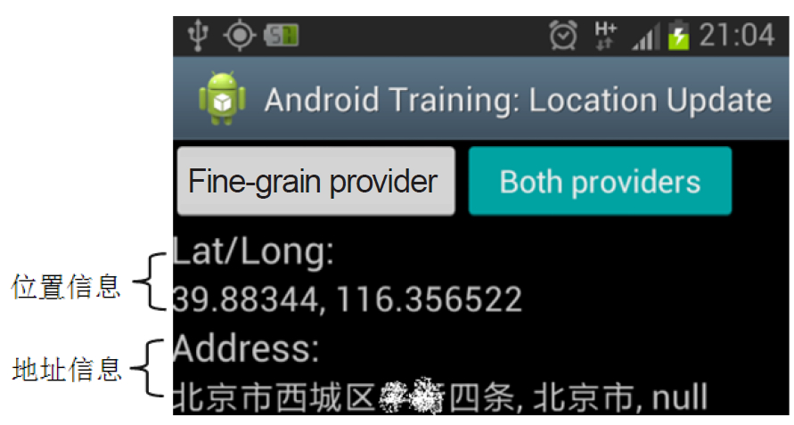

# 9.3.2 LocationManager应用示例


9.3.2LocationManager应用示例本节所使用的示例运行后的界面如图9-30所示。



图9-30示例运行效果❑左边按钮为"Fine-grainprovider"，表示通过GpsLP来获取位置信息。

❑右边按钮为"BothProviders"，表示同时使用GpsLP和NetworkLP来获取位置信息。

❑按钮下方的"Lat/Long"表示当前设备的位置

```java
public void onCreate(Bundle savedInstanceState) {
    super.onCreate(savedInstanceState);
    setContentView(R.layout.main);
    ......// UI 等初始化
    // Geocoder：只有Android 2.3版本以后系统才支持该功能
    // 同时还需要判断是否存在GeocoderProvider
    mGeocoderAvailable =
               Build.VERSION.SDK_INT ＞= Build.VERSION_CODES.GINGERBREAD &&
                 Geocoder.isPresent();
    mHandler = new Handler() {......// Handler的作用是更新图9-30中的位置和地址信息};
    // 客户端必须要获取LocationManager来和LMS交互
    mLocationManager = (LocationManager) getSystemService(Context.LOCATION_SERVICE);
    }
```

信息（经纬度值）​，而"Address"表示根据该位置信息得到的地址信息。

示例非常简单，所有内容都集中在LocationActivity.java文件中。先来看onCreate函数，代码如下所示。

[--＞LocationActivity.java：​：onCreate]

```java
private void setup() {
  Location gpsLocation = null;  Location networkLocation = null;
  mLocationManager.removeUpdates(listener);
  mLatLng.setText(R.string.unknown);  mAddress.setText(R.string.unknown);
  if (mUseFine) { // mUseFine对应为图9-30中的“Fine-grain Provider”按钮
      ......
      //  requestUpdatesFromProvider为关键函数，下文将详细分析
      gpsLocation = requestUpdatesFromProvider(
                     LocationManager.GPS_PROVIDER,// 该参数为字符串，值为“gps”
                     R.string.not_support_gps);
      if (gpsLocation != null) updateUILocation(gpsLocation);
  } else if (mUseBoth) {// mUseBoth对应为图9-30中的“Both Providers”按钮
      gpsLocation = requestUpdatesFromProvider(
                  LocationManager.GPS_PROVIDER, R.string.not_support_gps);
      networkLocation = requestUpdatesFromProvider(
                  LocationManager.NETWORK_PROVIDER, // 该参数值为“network”
                  R.string.not_support_network);
      ......
  }
}
```

接着，LocationActivity在其onResume中将调用setup函数完成进一步的初始化工作，其代码如下所示。

[--＞LocationActivity.java：​：setup]

```java
private Location requestUpdatesFromProvider(final String provider,
               final int errorResId) {
  Location location = null;
  // 判断由provider指定的LP是否启用。
  if (mLocationManager.isProviderEnabled(provider)) {
      /*
      调用LocationManager的requestLocationUpdates函数，该函数用于注册一个回调函数以
      接收位置变化信息，其各个参数的作用如下。
      provider：用于指明使用哪个LP，目前可取参数有“gps”（对应为GpsLP）、“network”（对应
      为NetworkLP）、“passive”（对应为PassiveProvider）。
      TEN_SECONDS:用于指明多少毫秒更新一次位置数据，本例中使用的值为10秒。
      TEN_METERS：用于指明位置变化多少时更新一次数据，本例中使用的值为10米。
      listener：类型为LocationListener，当位置发生变化时，其onLocationChanged函数将被调用。
      */
      mLocationManager.requestLocationUpdates(provider, TEN_SECONDS,
                                                      TEN_METERS,listener);
      // getLastKnownLocation用于获取LP上一次保存的位置信息数据
      // Android平台中，位置信息用Location类表示
      location = mLocationManager.getLastKnownLocation(provider);
  }
  return location;
}
```

看setup中的关键函数requestUpdatesFromProvider代码如下所示。

[--＞LocationActivity.java：​：

requestUpdatesFromProvider]

```java
private final LocationListener listener = new LocationListener() {
  public void onLocationChanged(Location location) {
        updateUILocation(location);// 下文将分析它
  }
  // 当用户在设置中启用或禁止相关LocationProvider后，下面这两个函数将被调用
  public void onProviderEnabled(String provider) {  }
  public void onProviderDisabled(String provider) {  }
  // 当LocationProvider的状态发生变化时，下面这个函数将被调用
  public void onStatusChanged(String provider, int status, Bundle extras) {}
};
```

```java
private void updateUILocation(Location location) {
  // updateUILocation的参数location代表对应LP得到的位置信息
  // 示例程序将根据该信息来更新图9-30中“Lat/Long”的值
  Message.obtain(mHandler, UPDATE_LATLNG,
         location.getLatitude() + ", " + location.getLongitude()).sendToTarget();
  // doReverseGeocoding根据位置信息来获取地址信息
  if (mGeocoderAvailable) doReverseGeocoding(location);
}
```

requestLocationUpdates是LM中非常重要的函数，请读者务必把握其用法。

当位置信息发生变化后，LocationListener的onChange函数将被调用。本例中使用的LocationListener相关代码如下所示。

updateUILocation函数代码如下所示。

[--＞LocationActivity.java：​：

LocationListener]updateUILocation]

```java
private class ReverseGeocodingTask extends AsyncTask＜Location, Void, Void＞ {
    Context mContext;
    ......
    protected Void doInBackground(Location... params) {
      // 创建一个Geocoder对象，它可用于处理地址信息和位置信息的转换
      Geocoder geocoder = new Geocoder(mContext, Locale.getDefault());
      Location loc = params[0];
      List＜Address＞ addresses = null;
      try {
            // getFromLocation用于根据位置信息来查询对应的地址信息
            addresses = geocoder.getFromLocation(loc.getLatitude(), loc.getLongitude(), 1);
      } ......
      if (addresses != null && addresses.size() ＞ 0) {
           Address address = addresses.get(0);
            String addressText = String.format("%s, %s, %s",
                    address.getMaxAddressLineIndex() ＞ 0 ? address.getAddressLine(0) : "",
                    address.getLocality(),address.getCountryName());
              // 更新图9-30中的“Address”信息
              Message.obtain(mHandler, UPDATE_ADDRESS, addressText).sendToTarget();
       }
      return null;
    }
}
```

doReverseGeocoding用于根据位置信息来获取地址信息，由于该工作往往需要通过网络来查询，所以doReverseGeocoding内部将创建一个AsyncTask用来完成此工作。我们直接来看AsyncTask的代码。

[--＞LocationActivity.java：​：

ReverseGeocodingTask]通过上述示例可以发现，Android平台中使用LM非常简单，其主要工作如下。

1）先创建一个LocationManager对象，用于和LMS交互。

2）然后调用requestLocationUpdates以设置一个回调接口对象LocationListener，同时还需要指明使用哪个LP。

3）当LP更新相关信息后，LocationListener对应的函数将被调用，应用程序在这些回调函数中做相关处理即可。

4）如果应用程序需要在位置和地址信息做转换，则使用Geocoder类提供的函数即可。

虽然LM比较简单，但它提供的都是一些很基本的功能，如果想实现一些诸如显示地图信息这样的功能，LM就无能为力了。为了实现一些更复杂的位置相关的功能，Google提供了更高级的API来帮助开发者。关于这一部分内容，建议读者阅读参考资料[30]​。
