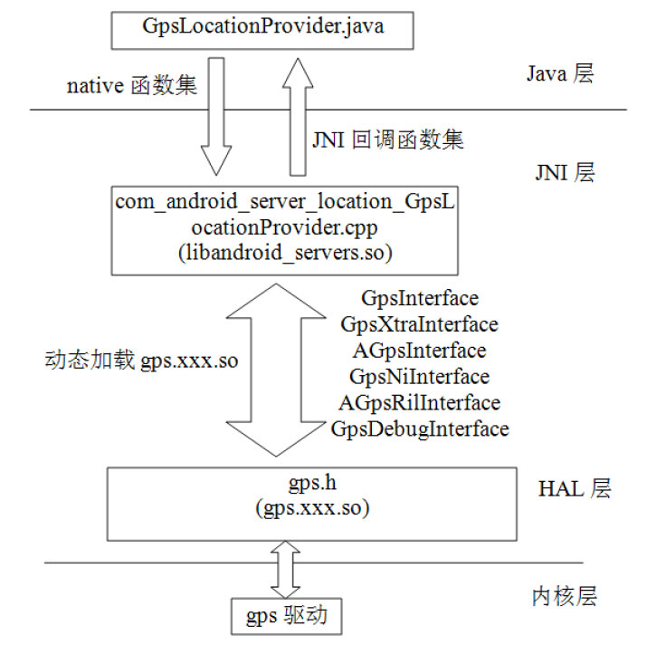
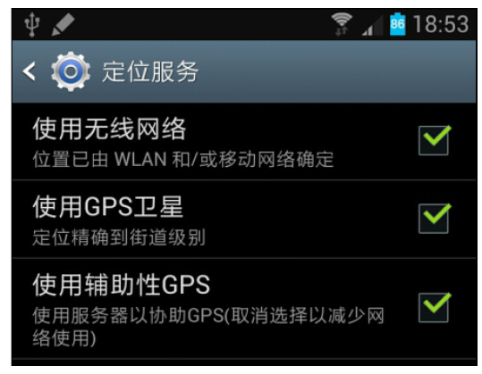
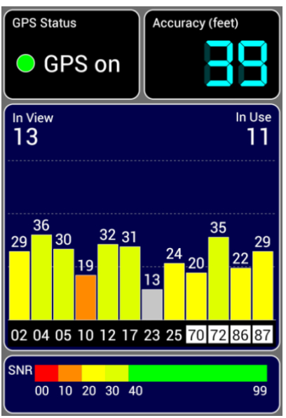

# 9.3.3 LocationManager系统模块


```java
public void systemReady() {
     // 创建一个工作线程，其线程函数为LocationManagerService中的run函数
     Thread thread = new Thread(null, this, THREAD_NAME);
     thread.start();
}
// 直接来看LMS的run函数
public void run() {
Process.setThreadPriority(Process.THREAD_PRIORITY_BACKGROUND);
     Looper.prepare();
    // 创建一个LocationWorkerHandler，其主要工作为将LP投递的位置信息返回给客户端
     mLocationHandler = new LocationWorkerHandler();
     init();// 重要的初始化函数
     Looper.loop();
  }
```

9.3.3LocationManager系统模块根据前文对Android平台中位置管理相关模块的介绍可知，LocationManagerService（LMS）是系统模块的核心，我们先来看它的初始化。

1.LMS初始化系统启动时，LMS将由SystemServer创建，其初始化函数为systemReady，代码如下所示。

LMS的主要初始化工作都集中在init中，该函[--＞LocationManagerService.java：​：

数的代码如下所示。

systemReady][--＞LocationManagerService.java：​：init]

```java
private void init() {
    ......// 创建Wakelock等工作。关于Wakelock的工作原理，可阅读《深入理解Android：卷Ⅱ》第5章
    // 系统有一个黑白名单用于禁止使用某些特定的LP。在黑白名单中，LP由其对应的Java包名指定
    mBlacklist = new LocationBlacklist(mContext, mLocationHandler);
    mBlacklist.init();
    /*
    LocationFudger很有意思，Android平台提供粗细两种精度的位置信息。其中，粗精度的位置信息由下面这个
    LocationFudger根据细精度的位置信息进行一定数学模糊处理后得到。粗精度默认的最大值为2000米，
    最小值为200米。厂商可在Settings.db数据库secure表的“locationCoarseAccuracy”设定。
    本章不讨论LocationFudger的内容，请感兴趣的读者自行研究。
    */
    mLocationFudger = new LocationFudger(mContext, mLocationHandler);
    synchronized (mLock) {
       loadProvidersLocked(); // 关键函数：创建或加载系统中的LP，下节将详细分析它
    }
    /*
    GeofenceManager为地理围栏管理对象。Android平台中其作用如下。
    客户端可以设置一个地理围栏，该地理围栏的范围是一个以客户端设置的某个点（指定其经/纬度）为中心
    的圆，圆的半径也由客户端设置。当设备进入或离开该地理围栏所覆盖的圆时，LMS将通过相关回调函
    数通知客户端。目前Android 4.2中还没有在SDK中公开地理围栏相关的API。有需要使用该功能
    的程序可通过Java放射机制调用LocationManager的addGeofence函数。
    GeofenceManager比较简单，感兴趣的读者也可自行阅读。
    */
    mGeofenceManager = new GeofenceManager(mContext, mBlacklist);
    ......// 监听APK安装\卸载等广播事件以及监听用户切换事件
    /*
    根据Settings中的设置情况来开启或禁止某个LP。在此函数中，各LP实现的
    LocationProviderInterface接口的enable/disable函数将被调用。
    */
    updateProvidersLocked();
}
```

```java
private void loadProvidersLocked() {
    /*
     先创建PassiveProvider。该LP名称中的Passive(译为“被动”)所对应的场景比较有意思，此
     处举一个例子。假设应用程序A使用GpsLP。GpsLP检测到位置更新后将通知应用程序A。应用程序B
     如果使用PassiveProvider，当GpsLP更新位置后，它也会触发PassiveProvider以通知应用程
     序B。也就是说，PassiveProvider自己并不能更新位置信息，而是靠其他LP来触发位置更新的。
     特别注意，PassiveProvider的位置更新是由LMS接收到其他LP的位置更新通知后主动调用
     PassiveProvider的updateLocation函数来完成的。
     目前，PassiveProvider被SystemServer中的TwilightService使用，TwilightService
     将根据位置信息来计算当前时间是白天还是夜晚（Twilight有“黎明”之意）（笔者在Android源码中经常能发现类似TwilightService这样在SDK中暂时还没有踪迹的模块。这些模块预示了Android未来版本中可能提供的一些新的功能。关于Twilight，Google Play上有一个比较有意思的APK，读者不妨安装试试，地址为https：//play.google.com/store/apps/details？id=com.urbandroid.lux。）。
     另外，GpsLP也会使用PassiveProvider来接收NeworkLP的位置信息。
     PassiveProvider非常简单，请读者在学完本章基础后再自行研究它。
    */
    PassiveProvider passiveProvider = new PassiveProvider(this);
    // LMS将保存所有的LP
    addProviderLocked(passiveProvider);
    // PassiveProvider永远处于启用状态。mEnabledProviders用于保存那些被启用的LP
    mEnabledProviders.add(passiveProvider.getName());
    mPassiveProvider = passiveProvider;
    if (GpsLocationProvider.isSupported()) {
          // 创建GpsLP实例，我们将用两节来介绍
          GpsLocationProvider gpsProvider = new GpsLocationProvider(mContext, this);
          mGpsStatusProvider = gpsProvider.getGpsStatusProvider();
          mNetInitiatedListener = gpsProvider.getNetInitiatedListener();
          addProviderLocked(gpsProvider);// 保存GpsLP
          // GpsLP属于真实的位置提供者，所以把它单独保存在mRealProvider中
          mRealProviders.put(LocationManager.GPS_PROVIDER, gpsProvider);
    }
    Resources resources = mContext.getResources();
    ArrayList＜String＞ providerPackageNames = new ArrayList＜String＞();
    /*
    config_locationProviderPackageNames存储了第三方LP的Java包名。Android原生代码中该值
    只有一个，为“com.android.location.fused”。FusedLP对应的源码路径为frameworks/base/
    packages/FusedLocation。
    */
    String[] pkgs = resources.getStringArray(
                 com.android.internal.R.array.config_locationProviderPackageNames);
    if (pkgs != null) providerPackageNames.addAll(Arrays.asList(pkgs));
    /*
      加载应用程序实现的LP服务时，LMS将检查它们的签名信息以及版本信息。笔者研究了这部分代码，
      感觉其目的可能是想提供一种数据一致性的保护机制，举个例子。
      笔者的Galaxy Note 2中默认安装的是百度提供的NetworkLocation_baidu.apk，
      笔者安装Google的NetworkLocation.apk时，由于二者签名不一致（根据LMS相关代码工的作原理可
      知，百度的NetworkLP属于config_locationProviderPackageNames指定的，其签名信息将被保存。
      后续再安装的LP将检查其签名是否和之前保存的签名信息是否一致。也就是说，后续的LP必须使用
      NetworkLocation_Baidu或FusedLP相同的签名才能被LMS加载。而FusedLP属于Android原生
      应用，一般由手机厂商提供，第三方应用程序不太可能拿到其签名)，根据上述信息可知，只有百度旗
      下或得到它授权的第三方LP才能在笔者的Galaxy Note 2中安装和使用。
      签名检查这部分代码在下文介绍的LocationProviderProxy中也有，读者仅了解其目的即可。
      ensureFallbackFusedProviderPresentLocked用来检查FusedLP的签名和版本信息。
    */
     ensureFallbackFusedProviderPresentLocked(providerPackageNames);
    /*
    加载NetworkLP，其中参数如下。
    NETWORK_PROVIDER:类型为字符串，值为“network”。
    NETWORK_LOCATION_SERVICE_ACTION:类型为字符串，值为
    “com.android.location.service.v2.NetworkLocationProvider”，
    它代表应用程序所实现的LP服务名，其作用见下节关于LocationProviderProxy的介绍。
    注意，和Android 4.1比起来，Android 4.2 LMS相关的代码变化较大，
    下文将介绍LocationProviderProxy的工作流程。
    */
    LocationProviderProxy networkProvider = LocationProviderProxy.createAndBind(
                mContext,LocationManager.NETWORK_PROVIDER,
                NETWORK_LOCATION_SERVICE_ACTION,
                providerPackageNames, mLocationHandler, mCurrentUserId);
    if (networkProvider != null) {
        // NetworkLP也属于真实的LP
        mRealProviders.put(LocationManager.NETWORK_PROVIDER, networkProvider);
        // 应用程序实现的LP保存在mProxyProviders变量中
        mProxyProviders.add(networkProvider);
        addProviderLocked(networkProvider);
    } ......
    // 加载FusedLP
    LocationProviderProxy fusedLocationProvider = LocationProviderProxy.createAndBind(
                mContext, LocationManager.FUSED_PROVIDER,
                FUSED_LOCATION_SERVICE_ACTION,
                providerPackageNames, mLocationHandler, mCurrentUserId);
    if (fusedLocationProvider != null) {
          addProviderLocked(fusedLocationProvider);
           mProxyProviders.add(fusedLocationProvider);
           // FusedLP默认处于启用的状态
           mEnabledProviders.add(fusedLocationProvider.getName());
           mRealProviders.put(LocationManager.FUSED_PROVIDER, fusedLocationProvider);
     } ......
    // 创建Geocoder。GeocoderProxy的工作流程和LocationProviderProxy类似
    mGeocodeProvider = GeocoderProxy.createAndBind(mContext, providerPackageNames,
             mCurrentUserId);
    ......
}
```

init函数的内容比较多，本节重点关注其中的loadProvidersLocked函数。

提示读者学完本章后不妨研究LocationFudger和GeofenceManager，其内容比较有意思。

（1）loadProvidersLocked流程loadProvidersLocked用于创建及加载系统中所有的LocationProvider，其代码如下所示。

[--＞LocationManagerService.java：​：

loadProvidersLocked]在LMS的初始化函数中，loadProvidersLocked用于创建和加载系统中所有的LP如下。

❑PassiveProvider：提供被动式的位置数据更新服务，其位置数据来源于其他的LP。

❑GpsLocationProvider：由LMS创建并加载，运行在LMS所在的进程system_process中，属于系统提供的LP服务。

❑NetworkLocationProvider：该LP服务由应用程序提供。

❑FusedLocationProvider：由FusedLocation.apk服务，属于系统提供的应用程序。其内部将使用其他的LP。

❑GeocodeProvider：由第三方应用程序提供。一般和NetworkLP位于同一个应用程序中。

对于本章来说，GpsLP是重中之重。不过在介绍它之前，我们先来看看LMS是如何与位于应用进程中的其他LP交互的。

（2）LocationProviderProxy介绍由loadProvidersLocked的代码可知，LMS通过LocationProviderProxy（简称LPProxy）

来加载应用进程中的LP。相关函数是LPProxy的createAndBind，代码如下所示。

[--＞LocationProviderProxy.java：​：

createAndBind]

```java
public static LocationProviderProxy createAndBind(Context context, String name, String action,
       List＜String＞ initialPackageNames, Handler handler, int userId) {
  // 创建一个LPProxy对象
  LocationProviderProxy proxy = new LocationProviderProxy(context, name, action,
              initialPackageNames, handler, userId);
  if (proxy.bind()) return proxy;
  else return null;
}
```

```java
private LocationProviderProxy(Context context, String name, String action,
            List＜String＞ initialPackageNames, Handler handler, int userId) {
  mContext = context;
  mName = name;
  /*
   ServiceWatcher是LPProxy中最重要的对象。在Android LM架构中，应用程序实现的LP服务都
   通过Android四大组件中的Service提供。ServiceWatcher就是LPProxy中用来连接和监视应用程序
   实现的LP服务的。
  */
  mServiceWatcher = new ServiceWatcher(mContext, TAG, action, initialPackageNames,
                mNewServiceWork, handler, userId);
}
```

```java
public boolean start() {
  synchronized (mLock) {
      // bindBestPackageLocked见下文解释
      if (!bindBestPackageLocked(null)) return false;
  }
  // 监听应用程序安装、卸载、更新等广播事件
  mPackageMonitor.register(mContext, null, UserHandle.ALL, true);
  return true;
}
```

LPProxy的createAndBind中有两个关键函数，分别是LPProxy的构造函数以及bind。我们先来看其构造函数，代码如下所示。

[--＞LocationProviderProxy.java：​：

在createAndBind函数的最后，LPProxy将调LocationProviderProxy]用bind函数，而这个bind将触发ServiceWatcher的start被调用，我们直接来看它。

[--＞ServiceWatcher.java：​：start]bindBestPackageLocked的工作包括如下。

❑检查目标应用程序的签名。

❑根据createAndBind第三个参数查找该目标应用程序实现的Service（Android四大组件之一）​。以NetworkLP为例，目标应用程序必须提供一个名为"com.android.location.service.v2.NetworkLocationProvider"的服务。

❑然后绑定到该服务上，并获取一个类型为ILocationProvider接口的实例。通过该实例，LPProxy可与位于应用程序中的LP服务交互。

bindBestPackageLocked中最重要的函数是bindToPackageLocked，其代码如下所示。

[--＞ServiceWatcher.java：​：

bindToPackageLocked]

```java
private void bindToPackageLocked(String packageName, int version) {
    unbindLocked();
    Intent intent = new Intent(mAction);
    intent.setPackage(packageName);
    mPackageName = packageName;
    mVersion = version;
    // 绑定到应用程序的LP Servic
    mContext.bindService(intent, this, Context.BIND_AUTO_CREATE |
         Context.BIND_NOT_FOREGROUND | Context.BIND_NOT_VISIBLE, mCurrentUserId);
}
```

绑定成功后，ServiceWathcer的onServiceConnected函数将被调用。

[--＞ServiceWatcher.java：​：

onServiceConnected]

```java
public void onServiceConnected(ComponentName name, IBinder binder) {
      synchronized (mLock) {
      String packageName = name.getPackageName();
      if (packageName.equals(mPackageName)) {
          mBinder = binder;
         if (mHandler !=null && mNewServiceWork != null)
               mHandler.post(mNewServiceWork);// mNewServiceWork由LPProxy提供
          }......
      }
}
```

mNewServiceWork是一个Runnable对象，

```java
private Runnable mNewServiceWork = new Runnable() {
        public void run() {
            boolean enabled;
            ProviderProperties properties = null; ProviderRequest request;
            WorkSource source; ILocationProvider service;
            synchronized (mLock) {
                enabled = mEnabled; request = mRequest;
                source = mWorksource;
              // 返回ILocationProvider接口实例，它可和应用程序中LP交互
                service = getService();
             }
            try {
                /*
                获取LP的属性信息，这些属性统一封装在类型为ProviderProperties的对象中，LP的属性
                由ProviderProperties的成员变量表示，这些变量如下。
                mRequiresNetwork：是否需要使用网络。
                mRequiresSatellite：是否需要使用卫星。
                mRequiresCell：是否需要使用基站。
                mHasMonetaryCost：是否需要计费。
                mSupportsAltitude：是否能提供海拔高度信息。
                mSupportsSpeed：是否提供速度信息。
                mSupportsBearing：是否支持方位信息。
                mPowerRequirement：耗电量级别，可取值有Criteria类定义的HIGH、MEDIUM和LOW三种级别。
                mAccuracy：精度级别，可取值有Criteria类定义的COARSE、FINE、HIGH、LOW四种级别。
                */
                properties = service.getProperties();
                ......
                if (enabled) {
                    service.enable();// 启动这个LP
                    if (request != null) {// 如果客户端有请求的话，则将该请求发送给LP
                        service.setRequest(request, source);
                    }
                }
            } catch ......
            synchronized (mLock) {
                mProperties = properties;
            }
        }
};
```

它由LPProxy提供，其代码如下所示。

[--＞LocationProviderProxy.java：​：

Runnable]至此，LMS的初始化工作暂告一段落，下面来看看GpsLocationProvider的创建。

（3）GpsLocationProvider初始化GpsLocationProvider类本身有一段初始化代码，如下所示。

```java
public GpsLocationProvider(Context context, ILocationManager ilocationManager) {
    mContext = context;
    /*
    NTP为Network Time Protocol之意，它是一种用来同步计算机时间的协议。该时间的源是UTC。
    在下面这行代码中，GpsLP将创建一个NtpTrustedTime对象，该对象将采用SNTP(Simple NTP)协议
    来和指定NTP服务器通信以获取准确的时间。Android平台中，NTP服务器可在两个地方设置。
    1)在系统资源文件中设置，由字符串config_ntpServer表示，默认值为“2.android.pool.ntp.org”。
     请求处理的超时时间由整型参数config_ntpTimeout控制，默认值为20000ms。
    2)也可在Settings的数据库中设置，对应的控制选项为“ntp_server”和“ntp_timeout”。
    NtpTrustedTime优先使用Settings设置的信息。
    NtpTrustedTime比较简单，对NTP感兴趣的读者见参考资料[31]。
    */
    mNtpTime = NtpTrustedTime.getInstance(context);
    mILocationManager = ilocationManager;
    // GpsNetInitiatedHandler和ULP Network Initiated请求有关
    // 主要处理来自GPS HAL层通知的NI（Network Initiated）事件
    mNIHandler = new GpsNetInitiatedHandler(context);
    mLocation.setExtras(mLocationExtras);
    ......
    mConnMgr = (ConnectivityManager)context.getSystemService(
                        Context.CONNECTIVITY_SERVICE);
    mProperties = new Properties();
    try {
        /*
        读取GPS配置文件，PROPERTIES_FILE的位置为“/etc/gps.conf”。
        笔者的Galaxy Note中，该文件的内容如下所示，其中“#”后的内容为笔者添加的注释。
        NTP_SERVER=north-america.pool.ntp.org #指定NTP_SERVER
        #下面这几个参数指定AGPS LTO（Long Term Orbits）数据的下载地址。LTO存储了GPS卫星
        #的星历数据。从下面这些地址中的“4day”来看，这些数据的有效期为4天。AGPS使用时需要
        #先从服务器上下载一些辅助数据。如果周围没有网络的情况下该怎么办呢? LTO就好比离线地图，
        #当周围没有网络时，终端可以利用事先保存的LTO数据来初始化GPS的定位。当然，LTO有时
        #效限制，一般是4天。
        XTRA_SERVER_1=http://gllto.glpals.com/4day/glo/v2/latest/lto2.dat
        XTRA_SERVER_2=http://gllto.glpals.com/4day/glo/v2/latest/lto2.dat
        XTRA_SERVER_3=http://gllto.glpals.com/4day/glo/v2/latest/lto2.dat
        SUPL_HOST=supl.google.com #指定SUPL的主机和端口
        SUPL_PORT=7276
        关于LTO，见参考资料[32]。
        */
        File file = new File(PROPERTIES_FILE);
        FileInputStream stream = new FileInputStream(file);
        mProperties.load(stream);// 解析该配置文件
        stream.close();
        // 获取配置文件中设置的SUPL主机地址以及端口号
        mSuplServerHost = mProperties.getProperty("SUPL_HOST");
        String portString = mProperties.getProperty("SUPL_PORT");
        if (mSuplServerHost != null && portString != null) {
            mSuplServerPort = Integer.parseInt(portString);
            ......
        }
         // C2K是CDMA2000的缩写。C2K_HOST和C2K_PORT主要用于GPS模块的测试
         // 对用户来说，这两个参数没有太大的意义（关于C2K的解释，笔者在此对高通公司资深研发经理毛晓冬的大力支持表示感谢。）
         mC2KServerHost = mProperties.getProperty("C2K_HOST");
         portString = mProperties.getProperty("C2K_PORT");
         if (mC2KServerHost != null && portString != null) {
               mC2KServerPort = Integer.parseInt(portString);
               ......
          }
        }......
    mHandler = new ProviderHandler();
    // SUPL的初始化可以由两种特殊的短信触发，下文将简单介绍listenForBroadcasts这个函数
    listenForBroadcasts();
    mHandler.post(new Runnable() {
        public void run() {
            LocationManager locManager =
               LocationManager) mContext.getSystemService(Context.LOCATION_SERVICE);
            // 接收来自NetworkLP的位置更新通知
            // 当GpsLP收到来自NetworkLP的位置信息后，将把它们传给GPS HAL层去处理
            locManager.requestLocationUpdates(LocationManager.PASSIVE_PROVIDER,
                      0, 0, new NetworkLocationListener(), mHandler.getLooper());
            }
       });
    }
}
```

[--＞GpsLocationProvider.java：​：static语句]

```java
// GpsLP定义了一些native函数，此处的class_init_native将初始化相关JNI方法。后文介绍
static { class_init_native(); }
```

接着来看GpsLP的创建，其代码如下所示。

[--＞GpsLocationProvider.java：​：

GpsLocationProvider]下面来看上述代码中提到的listenForBroadcasts函数，其内容如下所示。

[--＞GpsLocationProvider.java：​：

listenForBroadcasts]

```java
private void listenForBroadcasts() {
        IntentFilter intentFilter = new IntentFilter();
        /*
         SUPL INIT流程可由一条特殊的数据短信（Data Message）触发。注意，数据短信和我们接触最多的
         文本短信（Text Message）不同。下面这个IntentFilter将接收发往127.0.0.1:7275的数据短信。
         7275为OMA-SUPL使用的端口号，关于OMA-SUPL端口号见可参考资料[28]。
         关于Android中数据短信的收发，见参考资料[33]。
        */
        intentFilter.addAction(Intents.DATA_SMS_RECEIVED_ACTION);
        intentFilter.addDataScheme("sms");
        intentFilter.addDataAuthority("localhost","7275");
        mContext.registerReceiver(mBroadcastReciever, intentFilter, null, mHandler);
        // SUPL INIT也可由WAP推送短信触发，该短信包含的数据类型为MIME中的
        // “application/vnd.omaloc-supl-init”
        intentFilter = new IntentFilter();
        intentFilter.addAction(Intents.WAP_PUSH_RECEIVED_ACTION);
        try {
            intentFilter.addDataType("application/vnd.omaloc-supl-init");
        }......
        mContext.registerReceiver(mBroadcastReciever, intentFilter, null, mHandler);
        // 监听ALARM事件和网络事件（CONNECTIVITY_ACTION）
        intentFilter = new IntentFilter();
        intentFilter.addAction(ALARM_WAKEUP);
        intentFilter.addAction(ALARM_TIMEOUT);
        // 监听网络事件，下文介绍AGPS时还会讨论它
        intentFilter.addAction(ConnectivityManager.CONNECTIVITY_ACTION);
        mContext.registerReceiver(mBroadcastReciever, intentFilter, null, mHandler);
    }
```

```java
private void checkSmsSuplInit(Intent intent) {
    SmsMessage[] messages = Intents.getMessagesFromIntent(intent);
    for (int i=0; i ＜messages.length; i++) {
           byte[] supl_init = messages[i].getUserData();
            native_agps_ni_message(supl_init,supl_init.length);
    }
}
private void checkWapSuplInit(Intent intent) {
    byte[] supl_init = (byte[]) intent.getExtra("data");
    native_agps_ni_message(supl_init,supl_init.length);
}
```

当GpsLP收到指定的数据短信或WAP推送短信后，checkSmsSuplInit或checkWapSuplInit函数将被调用。这两个函数的功能比较简单，就是将短信的内容传递到G至P此SH，ALLM层S，的来初看始看化它流们程的代就码算。介绍完毕。

LMS本身还包括其他一些功能，例如通知客[--＞GpsLocationProvider.java：​：

户端位置更新等。这部分内容都比较简单，读checkSmsSuplInit和checkWapSuplInit]者完全可自行学习并掌握它们。

下面来看GpsLP的工作流程。

2.GpsLP工作流程分析GpsLP整体结构如图9-31所示。GpsLP分为Java、JNI层、HAL层以及内核层。其中，JNI层和HAL层都属于Native层。



图9-31GpsLP架构❑Java层主要文件是GpsLocationProvider.java。它通过native函数集与JNI层模块通信。本章后文将介绍native函数集的内容。

❑JNI层包括一个核心动态库，即libandr-oid_server.so。其中，和GpsLP相关的JNI函数位于com_android_server_loca-tion_GpsLocationProvider.cpp中。JNI层通过JNI回调函数集将GPS信息返回给Java层。

本章后文将介绍JNI回调函数集的内容。

❑HAL层也包含一个核心动态库，其命名规范为"gps.xxx.so"。其中，"xxx"为手机所使用的硬件平台名。以笔者的GalaxyNote2为例，对应的GPSHAL层动态库文件名为gps.exynos4.so。Android系统为GPSHAL层和GPSJNI层双写通信定义了多个接口函数集（如GpsInterface等，它们都定义在gps.h文件中）​，下文介绍。

❑最后，GPSHAL层将和内核层中的gps驱动交互。

这里要特别对GPSHAL层进行说明。从AOSP源码来看，几大厂商都没有公开其GPSHAL层的实现，AOSP中GPSHAL模块的默认实现也没有可参考价值。同时，网络上能找到的关于GPSHAL模块（从HAL层到驱动层）的框架或设计资料非常少。基于上述考虑，本节对GPSHAL层介绍的内容将集中在GpsInterface等JNI与HAL层交互接口上。

注意高通公司在其开源的QRD（高通参考设计）代码中提供了高通平台GPSHAL层模块的实现，但高通平台HAL层实现采用的是C/S架构。GPSHAL模块仅仅将上层请求转成QMI（QCMSMInterface）消息并发送给相关服务去处理。同样，由于缺乏相关文档，笔者很难搞清楚高通平台上GPS模块的具体工作流程。

下面我们将从Java层开始介绍GpsLP的工作流程。首先是GPS的启动流程。

（1）启动GPS

```java
public boolean onPreferenceTreeClick(PreferenceScreen preferenceScreen,
                        Preference preference) {
    final ContentResolver cr = getContentResolver();
    if (preference == mNetwork) {// 对应图9-32中“使用无线网络”选项
         Settings.Secure.setLocationProviderEnabled(cr,
                    LocationManager.NETWORK_PROVIDER, mNetwork.isChecked());
    } else if (preference == mGps) {// 对应图9-32中“使用GPS卫星”选项
            boolean enabled = mGps.isChecked();
            Settings.Secure.setLocationProviderEnabled(cr,
                    LocationManager.GPS_PROVIDER, enabled);
            if (mAssistedGps != null) {
                mAssistedGps.setEnabled(enabled);
      }
    } else if (preference == mAssistedGps) {// 对应图9-32中“使用辅助性GPS”选项
            // 注意，国内某些运营商定制的手机没有该选项。此处将直接修改Settings
          // 数据库中secure表中“assisted_gps_enabled”字段值
            Settings.Global.putInt(cr, Settings.Global.ASSISTED_GPS_ENABLED,
                    mAssistedGps.isChecked() ? 1 : 0);
    }
    return true;
}
```

Android平台中，GPS的开启和关闭主要在设置程序中控制，相关控制界面如图9-32所示。



图9-32定位服务设置界面当用户单击图9-32中三个选择框时，以下函数将被触发。

[--＞LocationSettings.java：​：

onPreferenceTreeClick]上述代码中的相关操作将修改settings数据库中location_providers_aowed字段。当“GPS卫星”和“无线网络”两项都选中时，location_providers_aowed字段取值将变成"network，gps"。显然，LMS只要通过ContentObserver（读者可参考《深入理解Android：卷Ⅱ》第7章。​）监听该字段的变化就可快速响应用户的设置。LMS中，设置对该字段监听的相关代码如下所示。

[--＞LocationManagerService.java：​：init]

```java
mContext.getContentResolver().registerContentObserver(
          Settings.Secure.getUriFor(Settings.Secure.LOCATION_PROVIDERS_ALLOWED), true,
          new ContentObserver(mLocationHandler) {
            public void onChange(boolean selfChange) {
               synchronized (mLock) {
                   updateProvidersLocked();// 最终调用的处理函数是updateProvidersLocked
            }
          }
  }, UserHandle.USER_ALL);
```

updateProvidersLocked除了根据设置的情况调用对应LP的enable或disable函数外，还需要通知LP的监听者（即9.3.1节应用示例中介绍的LocationListener对象）​。根据LP的启

```java
private void handleEnable() {
    synchronized (mLock) {
            if (mEnabled) return;
            mEnabled = true;
        }
      boolean enabled = native_init(); // 初始化GPS HAL层模块
    if (enabled) {
        mSupportsXtra = native_supports_xtra(); // 判断GPS模块是否支持Xtra
            if (mSuplServerHost != null) {// 设置SUPL服务器地址和端口
                native_set_agps_server(AGPS_TYPE_SUPL, mSuplServerHost, mSuplServerPort);
            }
            if (mC2KServerHost != null) {
                native_set_agps_server(AGPS_TYPE_C2K, mC2KServerHost, mC2KServerPort);
            }
    }......// 处理disabled的情况
```

动或禁止情况，LocationListener的onProviderEnabled/onProviderDisabled将被调用。

现在，重点介绍GpsLP的enable函数。该函数内部将发送ENABLE_MSG消息，而该消息最终将调用GpsLP的handleEnable进行处理。该函数的代码如下所示。

[--＞GpsLocationProvider.java：​：

handleEnable]在handleEnable函数中，GpsLP主要通过调用native函数集中的几个函数来初始化底层GPS模块。这些函数将在介绍GPSHAL层时再来详细介绍。

当GPS模块启动成功后，GPSHAL层将通过JNI回调函数通知GpsLP底层GPS引擎的工作能力，这个回调函数是setEngineCapabilities，其代码如下所示。

[--＞GpsLocationProvider.java：​：

setEngineCapabilities]

```java
private void setEngineCapabilities(int capabilities) {
        mEngineCapabilities = capabilities; // capabilities代表GPS引擎的工作能力，详情见下文解释
        if (!hasCapability(GPS_CAPABILITY_ON_DEMAND_TIME) && !mPeriodicTimeInjection) {
            mPeriodicTimeInjection = true;
            requestUtcTime();// 输入UTC时间信息
        }
    }
```

目前，Android平台中定义的GPS引擎工作能力取值有如下几种。

❑GPS_CAPABILITY_SCHEDULING：如果设置，则GPS模块在工作周期内（即GPS开启之后，关闭之前这一段时间）能定时通知位置信息，例如每10秒通知一次位置信息。如果GPS模块不支持该功能，表明GPS模块在每个工作周期内只能通知一次位置信息。对于这种GPS，GpsLP将通过不断启动和关闭GPS模块来模拟实现GPS_CAPABILITY_SCHEDULING的功能。下文代码中将介绍模拟实现方面的内容。

❑GPS_CAPABILITY_MSB：如果设置，则GPS模块支持MobileServiceBasedAGPS。

❑GPS_CAPABILITY_MSA：如果设置，则GPS模块支持MobileServiceAssistedAGPS。

❑GPS_CAPABILITY_SINGLE_SHOT：如果设置，表明GPS模块支持单次定位。与单次定位相对应的是连续定位。

❑GPS_CAPABILITY_ON_DEMAND_TIME：GPS在工作周期内可能需要UTC时间信息。

如果设置此能力，GPS模块在需要UTC时间信息时将主动通过相关回调函数（即代码中的requestUtcTime函数，JNI层也会直接调用它）从GpsLP那获取UTC时间。如果没有设置它，则GpsLP将每隔24小时获取UTC时间并输入给GPS模块。

提示简单来说，GPS_CAPABILITY_SCHEDULING表示GPS模块支持连续定位，即GPS模块会不断更新位置信息。而GPS_CAPABILITY_SINGLE_SHOT表示GPS模块支持单次定位，即只GPS模块只会通知一次位置信息。单次定位功能适用于那些无需连续获取位置信息的应用程序。这样，GPS通知完位置信息后即可停止工作以节省电力。另外，LocationManager中有一个requestSingleUpdate函数，其功能和单次定位类似。但由于不是所有GPS模块都支持单次定位，所以代码中并没有利用GPS_CAPABILITY_SINGLE_SHOT标志。

现在，假设GPS启动成功，接下来的工作就是启动GPS导航功能。

（2）启动GPS导航当客户端调用LocationManager的requestLocationUpdates并设置使用GpsLP（可参考9.3.1节中的示例代码）后，GpsLP的setRequest函数将被调用，该函数的代码如下所示。

```java
private void handleSetRequest(ProviderRequest request, WorkSource source) {
    if (request.reportLocation) {// 该变量用于判断客户端是否要求接收位置更新信息
        ......// 监视客户端的用电情况。略去相关内容
         mFixInterval = (int) request.interval;// 客户端设置的位置更新间隔
        if (mFixInterval != request.interval)
              mFixInterval = Integer.MAX_VALUE;
        // mStarted变量用于判断导航是否已经开启
        if (mStarted && hasCapability(GPS_CAPABILITY_SCHEDULING)) {
         /*
         如果GPS模块支持定时通知位置信息，则设置其运行模式为GPS_POSITION_RECURRENCE_PERIODIC，
         同时还需要将间隔时间传递给GPS模块。
         */
         if (!native_set_position_mode(mPositionMode, GPS_POSITION_RECURRENCE_PERIODIC,
                        mFixInterval, 0, 0))
                    Log.e(TAG, "set_position_mode failed in setMinTime()");
        } else if (!mStarted) {// 如果之前没有启动导航，则此处启动它
          startNavigating();// 下文分析
      }
      } else {
        updateClientUids(new int[0]);// 计算客户端耗电情况
        stopNavigating();// 停止导航
        mAlarmManager.cancel(mWakeupIntent);
        mAlarmManager.cancel(mTimeoutIntent);
        }
}
```

[--＞GpsLocationProvider.java：​：

setRequest]

```java
public void setRequest(ProviderRequest request, WorkSource source) {
 // 发送SET_REQUEST消息
 // 注意，GpsLP将把客户端发送的ProviderRequest转换成GpsLP使用的GpsRequest
 sendMessage(SET_REQUEST, 0, new GpsRequest(request, source));
}
```

SET_REQUEST消息将由handleSetRequest处理，其代码如下所示。

[--＞GpsLocationProvider.java：​：

handleSetRequest]假设之前没有启动导航，根据上述代码可知，startNavigating将被调用，相关代码如下所示。

[--＞GpsLocationProvider.java：​：

startNavigating]

```java
private void startNavigating() {
  if (!mStarted) {
    mTimeToFirstFix = 0;   mLastFixTime = 0;
    mStarted = true;
  mPositionMode = GPS_POSITION_MODE_STANDALONE;
   // 默认工作模式为GPS，即不使用AGPS
  if (Settings.Global.getInt(mContext.getContentResolver(),
                 Settings.Global.ASSISTED_GPS_ENABLED, 1) != 0) {
        if (hasCapability(GPS_CAPABILITY_MSB))
            // 如AGPS启用，则设置工作模式为AGPS，并且采用MSB
            mPositionMode = GPS_POSITION_MODE_MS_BASED;
  }
  // 如果GPS模块不支持定时通知位置信息，则interval取值为1秒
  int interval = (hasCapability(GPS_CAPABILITY_SCHEDULING) ? mFixInterval : 1000);
  if (!native_set_position_mode(mPositionMode, GPS_POSITION_RECURRENCE_PERIODIC,
          interval, 0, 0)) {......// 设置定位模式失败处理}
   if (!native_start()) {......// 导航启动失败处理}
    // 清空GPS卫星信息
    updateStatus(LocationProvider.TEMPORARILY_UNAVAILABLE, 0);
    mFixRequestTime = System.currentTimeMillis();
    // 如果GPS模块不支持定时通知位置信息
     if (!hasCapability(GPS_CAPABILITY_SCHEDULING)) {
             /*
             NO_FIX_TIMEOUT为60秒。对于那些不支持定时通知的GPS模块来说，如果客户端要求的
             更新间隔大于60秒，并且在这之间没有收到GPS的位置通知（这表明GPS还没定位自己
             的位置），则此处会设置一个超时控制以停止GPS导航。此处的代码逻辑需要结合GpsLP
             中正常的超时管理逻辑来理解。
             */
             if (mFixInterval ＞= NO_FIX_TIMEOUT)
                  mAlarmManager.set(AlarmManager.ELAPSED_REALTIME_WAKEUP,
                          SystemClock.elapsedRealtime() + NO_FIX_TIMEOUT, mTimeoutIntent);
            }
      }
}
```

此处介绍GpsLP如何处理那些不能定时通知位置信息的GPS引擎。GpsLP将注册两个定时触发Intent用于启用和关闭GPS。

❑ALARM_TIMEOUT：在该Intent的处理中，GpsLP将停止导航。

❑ALARM_WAKEUP：在该Intent的处理中，GpsLP将启用导航。

（3）位置信息通知处理当GPS模块更新位置时，GPSJNI层将调用GpsLP的reportLocation函数，其代码如下

```java
private void reportLocation(int flags, double latitude, double longitude, double altitude,
              float speed, float bearing, float accuracy, long timestamp) {
    synchronized (mLocation) {
       mLocationFlags = flags; // 标志信息
     // 此次通知的位置消息是否有经纬度信息
     if ((flags & LOCATION_HAS_LAT_LONG) == LOCATION_HAS_LAT_LONG) {
          mLocation.setLatitude(latitude);// 设置经纬度及时间戳
          mLocation.setLongitude(longitude);
          mLocation.setTime(timestamp);
          mLocation.setElapsedRealtimeNanos(SystemClock.elapsedRealtimeNanos());
    }
    // 检查是否有海拔信息
    if ((flags & LOCATION_HAS_ALTITUDE) == LOCATION_HAS_ALTITUDE)
         mLocation.setAltitude(altitude);
     else    mLocation.removeAltitude();
     // 检查是否有速度信息
     if ((flags & LOCATION_HAS_SPEED) == LOCATION_HAS_SPEED)
                mLocation.setSpeed(speed);
     else  mLocation.removeSpeed();
     // 检查是否有方位信息
    if ((flags & LOCATION_HAS_BEARING) == LOCATION_HAS_BEARING)
            mLocation.setBearing(bearing);
    else mLocation.removeBearing();
    // 是否有精度信息（以米为单位）
    if ((flags & LOCATION_HAS_ACCURACY) == LOCATION_HAS_ACCURACY)
            mLocation.setAccuracy(accuracy);
    else mLocation.removeAccuracy();
    mLocation.setExtras(mLocationExtras);
    try {
        // mILocationManager指向LMS，它会把此处的位置信息通知给客户端
        mILocationManager.reportLocation(mLocation, false);
      }......
    }//  synchronized (mLocation)代码段结束
     mLastFixTime = System.currentTimeMillis();
    // 计算首次定位时间，即TTFF
    if (mTimeToFirstFix == 0 && (flags & LOCATION_HAS_LAT_LONG) ==
                           LOCATION_HAS_LAT_LONG) {
           mTimeToFirstFix = (int)(mLastFixTime - mFixRequestTime);
           synchronized (mListeners) {
               int size = mListeners.size();
               for (int i = 0; i ＜ size; i++) {
                   Listener listener = mListeners.get(i);
               try {
                   /*
                   GpsLP还支持另外一种类型的监听者，即GpsStatusListener，
                   主要用来通知GPS卫星信息。客户端通过LocationManager的
                   addGpsStatusListener来注册监听对象。
                   此处将调用GpsStatusListenr的onFirstFix函数。
                   */
                   listener.mListener.onFirstFix(mTimeToFirstFix);
               }......
            }
        }
    }
    ......
    /*
     对于不支持GPS_CAPABILITY_SCHEDULING的GPS模块来说，当GpsLP收到一次位置通知事件后，
     它将先暂停GPS导航，然后等到超时时间到达后，再启用导航。
    */
    if (mStarted && mStatus != LocationProvider.AVAILABLE) {
        // 和startNavigating函数最后一段代码相对应，取消在那里设置的超时监控
        if (!hasCapability(GPS_CAPABILITY_SCHEDULING) && mFixInterval ＜ NO_FIX_TIMEOUT)
            mAlarmManager.cancel(mTimeoutIntent);// 取消超时控制
        Intent intent = new Intent(LocationManager.GPS_FIX_CHANGE_ACTION);
        intent.putExtra(LocationManager.EXTRA_GPS_ENABLED, true);
        mContext.sendBroadcastAsUser(intent, UserHandle.ALL);
        updateStatus(LocationProvider.AVAILABLE, mSvCount);
    }
    // 对于不支持GPS_CAPABILITY_SCHEDULING功能的GPS模块，GpsLP将软件模拟连续定位功能
    if (!hasCapability(GPS_CAPABILITY_SCHEDULING) && mStarted &&
                 mFixInterval ＞ GPS_POLLING_THRESHOLD_INTERVAL)
        hibernate();  // 停止导航。该函数中将设置ALARM_WAKEUP定时任务以重新启用导航
}
```

所示。

[--＞GpsLocationProvider.java：​：

reportLocation]GpsLP处理位置通知的相关代码主要就在上面介绍的reportLocation中。GpsLP最终会将位置信息告诉LMS，而LMS的

```java
private void reportStatus(int status) {
        synchronized (mListeners) {
            boolean wasNavigating = mNavigating;
          // 根据状态来更新mNavigating和mEngineOn这两个变量
            switch (status) {
              // 下面这两个状态分别表示GPS导航开始和结束
              case GPS_STATUS_SESSION_BEGIN: {......}
              case GPS_STATUS_SESSION_END: {......}
              // 下面这两个状态分别表示GPS引擎开启和关闭
              case GPS_STATUS_ENGINE_ON: {......}
              case GPS_STATUS_ENGINE_OFF:{......}
            }
            if (wasNavigating != mNavigating) {
                int size = mListeners.size();
                for (int i = 0; i ＜ size; i++) {
                    Listener listener = mListeners.get(i);
                    try {// 调用GpsListener的onGpsStarted函数或onGpsStopped函数
                        if (mNavigating)   listener.mListener.onGpsStarted();
                        else listener.mListener.onGpsStopped();
                    }......
                }
                // 发送广播
                Intent intent = new Intent(LocationManager.GPS_ENABLED_CHANGE_ACTION);
                intent.putExtra(LocationManager.EXTRA_GPS_ENABLED, mNavigating);
                mContext.sendBroadcastAsUser(intent, UserHandle.ALL);
            }
        }
}
```

handleLocationChanged函数还有许多工作要接着开展。这部分内容请读者自行阅读。

（4）reportStatus和reportSvStatus除了通知位置信息外，GPS模块还会通过reportStatus向GpsLP反馈GPS模块的工作状态，该函数如下所示。

[--＞GpsLocationProvider.java：​：

reportStatus]

```java
private void reportSvStatus() {
    /*
     下面这个函数用于从GPS HAL层读取卫星的状态，其返回值为卫星的个数。
     该函数每个参数的类型都是一个int数组，其中，除最后一个参数对应的int数组元素个数为3外，
     而其他参数的int数组元素个数为MAX_SVS（值为32），每个参数的作用如下。
     mSvs:用于存储卫星的编号。
     mSnrs：用于存储卫星的SNR（信号噪声比）。
     mSvElevations：存储卫星的高度信息。
     mSvAzimuths：存储卫星的方位信息。
     mSvMasks：该数组包含三个整型值，每个整型值字长32位，分别对应32颗卫星。
     EPHEMERIS_MASK（值为0）：该变量的每一位代表GPS模块是否获取了该卫星的ephemeris数据。
     ALMANAC_MASK（值为1）：该变量的每一位代表GPS模块是否获取了该卫星的almanac数据。
     USED_FOR_FIX_MASK（值为2）：该变量的每一位代表该卫星是否参与了上一次的定位信息计算。
    */
    int svCount = native_read_sv_status(mSvs, mSnrs,
                  mSvElevations, mSvAzimuths, mSvMasks);
    synchronized (mListeners) {
            int size = mListeners.size();
            for (int i = 0; i ＜ size; i++) {
                Listener listener = mListeners.get(i);
                try {// 通知客户端
                    listener.mListener.onSvStatusChanged(svCount, mSvs, mSnrs,
                    mSvElevations, mSvAzimuths, mSvMasks[EPHEMERIS_MASK],
                    mSvMasks[ALMANAC_MASK], mSvMasks[USED_FOR_FIX_MASK]);
                }......
            }
        }
        updateStatus(mStatus, Integer.bitCount(mSvMasks[USED_FOR_FIX_MASK]));
        ......
}
```

reportStatus比较简单，读者了解即可。另外，GPS模块也会通过reportSvStatus返回卫星的信息，这个函数比较有意思，我们来看看。

[--＞GpsLocationProvider.java：​：

reportSvStatus]只要监听这些信息，读者就能实现类似GpsTestPlus应用的效果，如图9-33所示。



图9-33GpsTestPlus应用效果提示GpsTestPlus是一个比较常用的GPS测试软件。笔者曾经反编译过GpsTestPlus，其中和LM相关的函数调用比较简单，感兴趣的读者可尝试研究其代码。

本节主要介绍了GpsLP的主要工作流程，与之相关的知识点如下。

❑GpsLP启动GPS、启动导航、位置信息处理、状态和卫星信息通知等几个主要工作的代码分析。从流程上来说，这部分代码难度非常小，笔者觉得大多数读者都能学会。

❑GPS工作能力等重要标志及相关处理逻辑。

❑GPSJava层调用的native函数。下文还将详细介绍这些函数的作用。

3.AGPS工作流程分析Android平台中，AGPS的处理逻辑也集中在GpsLocationProvider.java中，本节就来介绍GpsLP中AGPS的相关代码。

（1）处理网络事件

```java
public void onReceive(Context context, Intent intent) {
    String action = intent.getAction();
    ......
      // 我们只关注CONNECTIVITY_ACTION事件
    } else if (action.equals(ConnectivityManager.CONNECTIVITY_ACTION)) {
    int networkState;
    // 获取网络状态
    if (intent.getBooleanExtra(ConnectivityManager.EXTRA_NO_CONNECTIVITY, false))
         networkState = LocationProvider.TEMPORARILY_UNAVAILABLE;
    else networkState = LocationProvider.AVAILABLE;
    // 获取网络事件的相关信息。NetworkInfo表示此次事件主角，它描述了哪个网络发生了什么事件
    NetworkInfo info =
                 intent.getParcelableExtra(ConnectivityManager.EXTRA_NETWORK_INFO);
    ConnectivityManager connManager = (ConnectivityManager)
                      mContext.getSystemService(Context.CONNECTIVITY_SERVICE);
    info = connManager.getNetworkInfo(info.getType());
    // 更新网络状态，其内部将发送UPDATE_NETWORK_STATE消息
    updateNetworkState(networkState, info);
    }
}
```

AGPS需要使用移动网络，所以早在GpsLP初始时，GpsLP就注册了对CONNECTIVITY_ACTION广播的监听。该广播事件由ConnectivityService发送，并且属于Sticky的广播。根据《深入理解Android：

卷Ⅱ》6.4.1节“registerReceiver分析之二”的介绍可知，对于Sticky广播的接收者而言，系统会立即调度一次广播发送流程以将当前的网络事件传递给监听者。也就是说，GpsLP的onReceive函数将很快被触发。该函数的代码如下所示。

[--＞GpsLocationProvider.java：​：

onReceive]

```java
private void handleUpdateNetworkState(int state, NetworkInfo info) {
    mNetworkAvailable = (state == LocationProvider.AVAILABLE);
    if (info != null) {
        // 判断系统是否允许使用移动数据
        boolean dataEnabled = Settings.Global.getInt(mContext.getContentResolver(),
        Settings.Global.MOBILE_DATA, 1) == 1;
        // 假设移动数据功能已经启用，故networkAvailable为true
        boolean networkAvailable = info.isAvailable() && dataEnabled;
        // 获取APN，APN（Acess Point Number）用于确定使用哪种方式连接到网络
        String defaultApn = getSelectedApn();
        if (defaultApn == null) defaultApn = "dummy-apn";
        // 将这些信息传递到GPS HAL层
        native_update_network_state(info.isConnected(), info.getType(),
                                    info.isRoaming(), networkAvailable,
                                    info.getExtraInfo(), defaultApn);
    }
     /*
     mAGpsDataConnectionState初始状态为AGPS_DATA_CONNECTION_CLOSED。该值在reportAGpsStatus
     中被修改。下面if这段代码逻辑需要结合reportAGpsStatus来综合理解。初次进来，if条件不满足。
     */
     if (info != null && info.getType() == ConnectivityManager.TYPE_MOBILE_SUPL
          && mAGpsDataConnectionState == AGPS_DATA_CONNECTION_OPENING) {
          /*
          注意，这段代码只有在mAGpsDataConnectionState状态为AGPS_DATA_CONNECTION_OPENING
          才起作用。
          */
          String apnName = info.getExtraInfo();
          if (mNetworkAvailable) {
          if (apnName == null) apnName = "dummy-apn";
            mAGpsApn = apnName;
            if (mAGpsDataConnectionIpAddr != 0xffffffff) {
            boolean route_result;
            // requestRouteToHost:将SUPL的数据都路由到指定的主机地址上
            route_result = mConnMgr.requestRouteToHost(ConnectivityManager.TYPE_MOBILE_SUPL,
                          mAGpsDataConnectionIpAddr);
          }
          native_agps_data_conn_open(apnName);// 打开数据通道
          mAGpsDataConnectionState = AGPS_DATA_CONNECTION_OPEN;
    }
    // 如果当前有可用网络，则GpsLP将获取NTP时间以及下载Xtra数据
    if (mNetworkAvailable) {
        if (mInjectNtpTimePending == STATE_PENDING_NETWORK)
            sendMessage(INJECT_NTP_TIME, 0, null);// 触发handleInjectNtpTime函数
        if (mDownloadXtraDataPending == STATE_PENDING_NETWORK)
            sendMessage(DOWNLOAD_XTRA_DATA, 0, null);// 触发handleDownloadXtraData函数
    }
}
```

UPDATE_NETWORK_STATE消息最终由handleUpdateNetworkState处理，此函数的代码如下所示。

[--＞GpsLocationProvider.java：​：

handleUpdateNetworkState]handleUpdateNetworkState还算比较简单，其主要工作如下。

❑如果GPS模块要求开启AGPS数据下载（这部分逻辑下节再介绍，即mAGpsDataConnectionState的值为AGPS_DATA_CONNECTION_OPENING）​，则handleUpdateNetwork将开展相关操作。

❑如果网络启用并且GpsLP之前没有获取过NTP时间以及下载过Xtra数据，GpsLP将通过INJECT_NTP_TIME和DOWNLOAD_XTRA_DATA两个消息获取NTP时间以及下载Xtra数据。

GPS模块什么时候会要求开启AGPS数据下载呢？相关函数集中在reportAGpsStatus中。

（2）reportAGpsStatus分析GPS模块将通过reportAGpsStatus和GpsLP交互，该函数代码如下所示。

[--＞GpsLocationProvider.java：​：

reportAGpsStatus]

```java
private void reportAGpsStatus(int type, int status, int ipaddr) {
  switch (status) {
    case GPS_REQUEST_AGPS_DATA_CONN:// GPS模块要求启用数据链接
        /*
        此处，设置mAGpsDataConnectionState为AGPS_DATA_CONNECTION_OPENING,
        该状态值表示数据链接处于开启过程中。
        */
        mAGpsDataConnectionState = AGPS_DATA_CONNECTION_OPENING;
        /*
        要求使用移动数据。startUsingNetworkFeature是ConnectivityManager中一个比较重要的函
        数，其第一个参数表示此处操作的网络是移动网络，第二个参数表示使用SUPL相关的功能。
        */
        int result = mConnMgr.startUsingNetworkFeature(
                        ConnectivityManager.TYPE_MOBILE, Phone.FEATURE_ENABLE_SUPL);
        mAGpsDataConnectionIpAddr = ipaddr; // 保存地址
        // APN_ALREADY_ACTIVE表示startUsingNetworkFeature指定的网络及功能已经启用
        if (result == PhoneConstants.APN_ALREADY_ACTIVE) {
            if (mAGpsApn != null) {// mAGpsApn在onReceive函数中被设置
              if (mAGpsDataConnectionIpAddr != 0xffffffff) {
                boolean route_result;
                route_result = mConnMgr.requestRouteToHost(
                          ConnectivityManager.TYPE_MOBILE_SUPL,mAGpsDataConnectionIpAddr);
                }
                native_agps_data_conn_open(mAGpsApn);// 调用native函数表示AGPS数据链接
                // 开启AGPS数据链接开启成功
                mAGpsDataConnectionState = AGPS_DATA_CONNECTION_OPEN;
        } else if (result == PhoneConstants.APN_REQUEST_STARTED) {
        // APN_REQUEST_STARTED表示startUsingNetworkFeature设置的请求已经发送给相关模块处理
        } else......
    break;
    // 下面这个值表示AGPS不再需要使用数据链接
    case GPS_RELEASE_AGPS_DATA_CONN:{......}
    break;
    // 下面这个值表示GPS模块中AGPS数据链接初始化完毕
    case GPS_AGPS_DATA_CONNECTED: {......}
     break;
    // 下面这个值表示GPS模块中AGPS数据链接完毕
     case GPS_AGPS_DATA_CONN_DONE: {......}
      break;
    // 下面这个值表示GPS模块中AGPS数据链接失败
     case GPS_AGPS_DATA_CONN_FAILED: {......}
      break;
    }
}
```

reportAGpsStatus主要对两个状态进行处理，即GPS_REQUEST_AGPS_DATA_CONN

```java
private void handleDownloadXtraData() {
  if (mDownloadXtraDataPending == STATE_DOWNLOADING) return;
  ......
  mDownloadXtraDataPending = STATE_DOWNLOADING;
  mWakeLock.acquire();
 // 利用后台线程下载数据
  AsyncTask.THREAD_POOL_EXECUTOR.execute(new Runnable() {
      public void run() {
        GpsXtraDownloader xtraDownloader = new GpsXtraDownloader(
                             mContext, mProperties);
        // 下载LTO数据
        byte[] data = xtraDownloader.downloadXtraData();
        // 将这些数据传递给GPS HAL层
        if (data != null) native_inject_xtra_data(data, data.length);
        // 发现XTtra数据下载完毕通知
        sendMessage(DOWNLOAD_XTRA_DATA_FINISHED, 0, null);
        ......
        mWakeLock.release();
    }
  });
}
```

和GPS_RELEASE_AGPS_DATA_CONN。

总之，当网络准备好后，GpsLP将调用native_agps_data_conn_open启用GPS模块中AGPS数据链接功能。

（3）下载Xtra数据最后，看看Xtra数据的下载处理，这部分功能由handleDownloadXtraData实现，代码如下所示。

[--＞GpsLocationProvider.java：​：

handleDownloadXtraData]GpsLP中的AGPS流程也比较简单。GpsLP只要监控网络事件以及接收来自GPSHAL层的AGPS状态通知即可顺利完成相关工作。

结合前面对GpsLP工作流程的分析可知，Android平台中，Java层的GPS模块和Native层（包括JNI和HAL层）GPS模块交互非常多，下面将重点分析GPSNative层方面的知识。

4.GPSJNI与HAL层在GpsLocationProvider初始化一节曾提到，GpsLocationProvider类有一个静态的初始化代码，在那段代码中，class_init_native函数将初始化JNI层相关模块。马上来看它。

（1）JNI与HAL层初始化class_init_native函数对应的JNI函数如下所示。

```java
static void android_location_GpsLocationProvider_class_init_native(JNIEnv* env, jclass clazz) {
    int err;
    hw_module_t* module;
    // 获取JNI回调函数集对应的Java MethodId
    // 如果不熟悉JNI，请阅读《深入理解Android：卷Ⅰ》第2章
    method_reportLocation = env-＞GetMethodID(clazz, "reportLocation", "(IDDDFFFJ)V");
    ......// JNI回调函数集的其他函数，下文会详细介绍它们
    method_setEngineCapabilities = env-＞GetMethodID(clazz, "setEngineCapabilities", "(I)V");
    ......
    // 加载GPS HAL层模块，GPS_HARDWARE_MODULE_ID的值为“gps”
      err = hw_get_module(GPS_HARDWARE_MODULE_ID, (hw_module_t const**)&module);
      if (err == 0) {
          hw_device_t* device;
          // 打开GPS HAL层模块
          err = module-＞methods-＞open(module, GPS_HARDWARE_MODULE_ID, &device);
          if (err == 0) {
              gps_device_t* gps_device = (gps_device_t *)device;
              // 获取GPS HAL层最主要的交互接口GpsInterface
              // 它是JNI层和HAL层的重要交互通道
              sGpsInterface = gps_device-＞get_gps_interface(gps_device);
          }
    }
    // GPS HAL模块对外还提供了几个重要交互接口
    if (sGpsInterface) {
        sGpsXtraInterface =  // 用来和GPS HAL层中xtra模块交互的接口
            (const GpsXtraInterface*)sGpsInterface-＞get_extension(GPS_XTRA_INTERFACE);
        sAGpsInterface = // 用来和GPS HAL层AGPS模块交互的接口
            (const AGpsInterface*)sGpsInterface-＞get_extension(AGPS_INTERFACE);
        sGpsNiInterface = // 用来和GPS HAL层NI（Network Initiated）模块交互的接口
            (const GpsNiInterface*)sGpsInterface-＞get_extension(GPS_NI_INTERFACE);
        sGpsDebugInterface = // 用来调试的接口
            (const GpsDebugInterface*)sGpsInterface-＞get_extension(GPS_DEBUG_INTERFACE);
        sAGpsRilInterface = // 用来和GPS HAL层AGPS及RIL相关的接口
            (const AGpsRilInterface*)sGpsInterface-＞get_extension(AGPS_RIL_INTERFACE);
    }
}
```

[--＞com_android_server_location_GpsLocationProvider.cpp：​：

android_location_GpsLocationProvider_class_init_native]GpsLP启用后，native_init函数将被调用，它对应的JNI函数代码如下所示。

```cpp
static jboolean android_location_GpsLocationProvider_init(JNIEnv* env, jobject obj)
{
    //  this must be set before calling into the HAL library
    if (!mCallbacksObj)
        mCallbacksObj = env-＞NewGlobalRef(obj);
    // 向GPS HAL层设置回调函数接口
    // 当GPS HAL层有情况需要通知JNI层时，这些回调函数将被调用
    if (!sGpsInterface || sGpsInterface-＞init(&sGpsCallbacks) != 0)
        return false;
    // 设置其他接口的回调函数
    if (sGpsXtraInterface && sGpsXtraInterface-＞init(&sGpsXtraCallbacks) != 0)
        sGpsXtraInterface = NULL;
    if (sAGpsInterface)  sAGpsInterface-＞init(&sAGpsCallbacks);
    if (sGpsNiInterface) sGpsNiInterface-＞init(&sGpsNiCallbacks);
    if (sAGpsRilInterface) sAGpsRilInterface-＞init(&sAGpsRilCallbacks);
    return true;
}
```

[--＞com_android_server_location_GpsLocationProvider.cpp：​：

android_location_GpsLocationProvider_init]通过上述代码可知，Android平台中通过定义多个交互接口实现了GPSJava层、JNI层以及HAL层的交互问题。显然，理解这些接口的作用将有助于我们学习Android平台中GPS模块的实现。下面介绍Java层与JNI层的交互接口。

（2）Java层与JNI层交互接口函数先来看GPSJava层调用的JNI函数，它们的作用如下所示。

```cpp
// 初始化JNI层相关的类型
native void class_init_native();
// 判断系统是否支持GPS
native boolean native_is_supported();
// 初始化GPS HAL层模块
native boolean native_init();
// 清理GPS HAL层模块所分配的资源
native void native_cleanup();
/*
  设置GPS模块工作模式，其各个参数取值含义如下。
  mode：GPS工作模式，目前可取值有GPS_POSITION_MODE_STANDALONE（值为0，仅GPS工作），
  GPS_POSITION_MODE_MS_BASED（值为1，AGPS MSB模式）、GPS_POSITION_MODE_MS_ASSISTED
  （值为2，AGPS MSA模式）。
  recurrence：位置更新模式，目前可取值有GPS_POSITION_RECURRENCE_PERIODIC（值为0，连续
  定位）、GPS_POSITION_RECURRENCE_SINGLE（值为1，单次定位）。
  min_interval:最短位置更新时间，单位为毫秒。
  preferred_accurary: 期望的位置更新精度，单位为米。
  preferred_time：期望的TTFF时间，单位为毫秒。
*/
native boolean native_set_position_mode(int mode,
           int recurrence, int min_interval,
           int preferred_accuracy, int preferred_time);
// 下面这两个函数用于启动和关闭导航
native boolean native_start();
native boolean native_stop();
// 删掉AGPS辅助数据，其flags参数的取值请读者阅读GpsLocationProvider.java的deleteAidingData函数
native void native_delete_aiding_data(int flags);
// 读取卫星信息，该函数在“reportStatus和reportSvStatus介绍”中学过
native int native_read_sv_status(int[] svs, float[] snrs,
            float[] elevations, float[] azimuths, int[] masks);
// 读取NMEA数据
native int native_read_nmea(byte[] buffer, int bufferSize);
// 输入位置信息，在GpsLP中，该位置信息由NetworkLP提供
native void native_inject_location(double latitude, double longitude, float accuracy);
/*
输入NTP时间。
time:为NtpTimeTrustedTime从网络中获取到的NTP时间。
timeReference：为设备从开机到一次NTP请求处理成功后的所耗费的时间，由SystemClock的
   elapsedRealtime函数返回。
uncertainty：准确度。在Android系统中，该值为NTP请求发送和接收往返时间的一般。详情可参考
   SnetpClient.java文件。
*/
native void native_inject_time(long time, long timeReference, int uncertainty);
// GPS模块是否支持XTRA数据
native boolean native_supports_xtra();
// 输入XTRA数据，即LTO数据
native void native_inject_xtra_data(byte[] data, int length);
// 用于调试，获取GPS模块内部状态
native String native_get_internal_state();
// 打开AGPS数据下载通道，参数apn指明了所要使用的APN
native void native_agps_data_conn_open(String apn);
// 关闭AGPS数据下载通道
native void native_agps_data_conn_closed();
// GpsLP处理AGPS相关事宜失败时候调用下面这个函数
native void native_agps_data_conn_failed();
// 将来自数据短信或WAP推送短信得到的信息传递给GPS模块
native void native_agps_ni_message(byte [] msg, int length);
/*
设置AGPS服务端地址，其中type取值有两种。
AGPS_TYPE_SUPL：值为1，代表SUPL服务器。
AGPS_TYPE_C2K：值为2，代表C2K服务器。
*/
native void native_set_agps_server(int type, String hostname, int port);
/*
当GPS模块需要使用APGS时，会调用reportNiNotification函数（详情见下文）以通知用户。
用户处理完后，将通过下面这个函数告知GPS模块处理结果。注意，这部分内容涉及OMA-SUPL相关知识，
请读者阅读参考资料[28]。该函数的参数如下。
notificationId：通知id，代表GPS HAL层的某一个处理请求。
userResponse有三种取值，分别是
GPS_NI_RESPONSE_ACCEPT:值为0，代表用户允许相关操作。
GPS_NI_RESPONSE_DENY:值为1，用户拒绝相关操作。
GPS_NI_RESPONSE_NORESP:值为2，代表用户无回应。
NI和GpsNetInitiatedHandler有关，读者可自行研究。
*/
native void native_send_ni_response(int notificationId, int userResponse);
/*
设置AGPS参考位置信息，其各参数解释如下。
type:取值可为AGPS_REF_LOCATION_TYPE_GSM_CELLID（值为1，代表GMS网络的cell id）、
     AGPS_REF_LOCATION_TYPE_UMTS_CELLID（值为2，代表CDMA网络的cell id）、
     AGPS_REG_LOCATION_TYPE_MAC（值为3，代表MAC地址）。
mcc：Mobile Country Code（移动国家码），由3位数字组成，唯一地识别移动用户所属的国家，中国为460。
mnc：Mobile Network Code（移动网络码），用于识别移动用户所归属的移动网络。中国移动TD系统使用00，
       中国联通GSM系统使用01，中国移动GSM系统使用02，中国电信CDMA系统使用03。
lac：Location Area Code（位置区码）。移动通信中，为了确定终端台的位置，每个移动网络的覆盖
       区都被划分成许多位置区，位置区码(LAC)则用于标识不同的位置区。
cid：cell id（基站编号）。
*/
native void native_agps_set_ref_location_cellid(int type, int mcc, int mnc,
            int lac, int cid);
/*
设置终端与移动网络相关的一些参数信息，其type参数决定了setid参数的取值。type可取值如下。
AGPS_SETID_TYPE_NONE:值为0，无意义。
AGPS_SETID_TYPE_IMSI:值为1，代表IMSI（international mobiles subscriber identity，
国际移动用户号码标识）。IMSI信息存储在SIM卡上。
AGPS_SETID_TYPE_MSISDN:值为2，代表Mobile Subscriber ISDN（用户号码），即手机号码。
*/
native void native_agps_set_id(int type, String setid);
/*
  通知GPS HAL层系统当前网络的状态，其各参数解释如下。
  connected：网络是否连接。
  type：网络类型，可取值请参考ConnectivityManager中各网络类型的定义情况。常用的有TYPE_MOBILE、
        TYPE_WIFI等。
  roaming：是否处于漫游状态。
  available：网络是否可用。
  extraInfo：附加信息。
  defaultAPN：默认APN。
*/
native void native_update_network_state(boolean connected, int type,
            boolean roaming, boolean available, String extraInfo, String defaultAPN);
```

[--＞GpsLocationProvider.java]现在来看看JNI回调Java层的函数，如下所示。

```java
// GPS模块汇报位置信息
void reportLocation(int flags, double latitude,
            double longitude, double altitude,
           float speed, float bearing, float accuracy, long timestamp)：
// GPS模块通知GPS工作状态
void reportStatus(int status)：
// GPS模块通知卫星状态
void reportSvStatus()：
// GPS模块通知AGPS状态
void reportAGpsStatus(int type, int status, int ipaddr)：
// GPS模块通知NMEA信息
void reportNmea(long timestamp)：
// GPS模块通知GpsLP自己的能力
void setEngineCapabilities(int capabilities)：
// GPS模块要求下载XTRA数据
void xtraDownloadRequest()：
// GPS模块通知Network Initiated通知，其各参数解释如下
void reportNiNotification(
            int notificationId, // GPS HAL层分配的通知ID
            int niType,         // NI类型，可取值请参考gps.h的GpsNiType的定义
            int notifyFlags,    // 标志信息，可取值请参考gps.h的GpsNiNotifyFlags定义
            int timeout,                // 等待用户处理的超时时间
            // 当超时发生后，系统采用的默认处理结果。其取值和native_send_ni_respons中第二个参数一样
            int defaultResponse,
            String requestorId, // 代表请求者的ID
            String text,                // 通知信息
            int requestorIdEncoding,    // requestorId的编码格式，参考gps.h GpsNiEncodingType的定义
            int textEncoding,   // text的编码格式
            String extras       // 附加信息
            )：
// 要求获取参考位置信息，flags参数目前没有使用
void requestRefLocation(int flags)：
// 要求设置移动网络相关信息，flags参数表示要获取什么样的信息
// 可取值同native_agps_set_id的type参数一致
void requestSetID(int flags)：
// 要求获取UTC时间
void requestUtcTime()：
```

[--＞GpsLocationProvider.java]

```java
typedef struct {
     size_t          size;// GpsInterface结构体的长度
    // 初始化GPS模块。其参数为GPS模块所需的回调函数
    int   (*init)( GpsCallbacks* callbacks );
    // 下面这两个函数用于开启或关闭导航
    int   (*start)( void );
    int   (*stop)( void );
    // 清理GPS模块所分配的资源
    void  (*cleanup)( void );
    // 输入UTC时间，参数解释同native_inject_time
    int   (*inject_time)(GpsUtcTime time, int64_t timeReference,int uncertainty);
    // 输入位置信息，参数解释同native_inject_location
    int  (*inject_location)(double latitude, double longitude, float accuracy);
    // 删除赋值信息，其参数解释同native_delete_aiding_data
    void  (*delete_aiding_data)(GpsAidingData flags);
    // 设置GPS模块的工作模式，其参数解释同native_set_position_mode
    int   (*set_position_mode)(GpsPositionMode mode,
            GpsPositionRecurrence recurrence,
            uint32_t min_interval, uint32_t preferred_accuracy,
            uint32_t preferred_time);
    // 获取GPS模块实现的扩展接口
    // AGPS扩展接口对应的name为“agps”、xtra扩展接口对应的name为“xtra”
    const void* (*get_extension)(const char* name);
}GpsInterface;
```

接下来看GPSJNI与HAL层的交互接口。主要介绍JNI调用HAL层的接口。

（3）GpsInterface及其他交互接口GpsInterface是GPSJNI与HAL层交互的主要接口。在Android平台中，该接口定义在一个同名的结构体中，其内容如下所示。

[--＞gps.h：​：GpsInterface结构体]

```c
typedef struct {
    size_t          size;
    // 初始化GPS中的xtra相关模块
    int  (*init)( GpsXtraCallbacks* callbacks );
    // 输入xtra数据，其参数解释同native_inject_xtra_data
    int  (*inject_xtra_data)( char* data, int length );
}GpsXtraInterface;
```

```c
typedef struct {
    size_t          size;
    // 初始化AGPS模块
    void  (*init)( AGpsCallbacks* callbacks );
    // 打开AGPS数据连接，其参数解释同native_data_conn_open
    int  (*data_conn_open)( const char* apn );
    // 关闭AGPS数据连接，其参数解释同native_data_conn_close
    int  (*data_conn_closed)();
    // AGPS数据连接操作失败，同native_data_conn_fail
    int  (*data_conn_failed)();
    // 设置AGPS服务器地址等相关信息，参数解释同native_agps_set_server
    int  (*set_server)( AGpsType type, const char* hostname, int port );
}AGpsInterface;
```

接下来看AGpsInterface结构体，代码如下所比较GpsInterface和Java层定义的native函示。

数，发现二者结合非常紧密。实际上，JNI实现[--的＞那gp些s.nha：​：tiveA函G数ps最In终te都rfa会c把e]请求通过HAL层接口交给GPS模块去处理。

再来看gps.h定义的GpsXtraInterface接口，相关内容封装在同名的结构体中，如下所示。

[--＞gps.h：​：GpsXtraInterface结构体]

```c
typedef struct
{
    size_t          size;
    // 初始化NI模块
    void (*init) (GpsNiCallbacks *callbacks);
    // 发送NI回复，请参数同native_send_ni_response
    void (*respond) (int notif_id, GpsUserResponseType user_response);
}GpsNiInterface;
```

```c
typedef struct {
   size_t          size;
   // 初始化AGPS Ril相关的处理模块
   void  (*init)( AGpsRilCallbacks* callbacks );
   // 设置参考位置信息，其第一个参数类型为AGpsRefLocation
   // 该结构体的成员与native_agps_set_ref_location_cellid函数的参数一一对应
   void (*set_ref_location) (const AGpsRefLocation *agps_reflocation,
             size_t sz_struct);
   // 设置AGPS移动网络ID信息，其参数解释同native_agps_set_id
   void (*set_set_id) (AGpsSetIDType type, const char* setid);
   // 设置NI消息，其参数解释同native_agps_ni_message
   void (*ni_message) (uint8_t *msg, size_t len);
   /*
   注意，下面这两个函数的参数合起来就是native_update_network_state的参数。Java层调用
   一次native_update_network_state将触发下面这两个函数被调用更新移动网络状态。
   */
   void (*update_network_state) (int connected, int type,
                 int roaming, const char* extra_info);
   // 设置网络连接状态
    void (*update_network_availability) (int avaiable, const char* apn);
}AGpsRilInterface;
```

AGpsRilInterface的代码如下所示。

[--＞gps.h：​：AGpsRilInterface]最后来看GpsNiInterface和AGpsRilInterface接口。GpsNiInterface的代码如下所示。

[--＞gps.h：​：GpsNiInterface]本节对Android平台中LocationManagerService及相关模块进行了介绍，尤其对本章的核心GpsLocationProvider及GPS各层次及之间的交互接口进行了重点讲解。

和本书前面介绍的WifiService、WifiP2pService以及NfcService比起来，LMS不复杂，这其中的主要原因包括以下。

❑LMS提供的服务本身比较简单，它的核心功能就是提供位置信息。

❑GpsLP通过合理的分层接口设计使得GPSHAL层之上的代码能够不受底层硬件的影响。

另外，希望读者在学习完本章后，对以下内容开展进一步的学习。

❑研究PassiveProvider和FusedLocationProvider的内容。掌握LMS如何与位于应用进程的LP进行交互。

❑学习LocationFudger的内容，掌握如何模糊位置信息。

❑学习GeofenceManager的内容。

最后，读者可尝试反编译NetworkLocation.apk，掌握NetworkLP以及Geocoder的实现原理。
