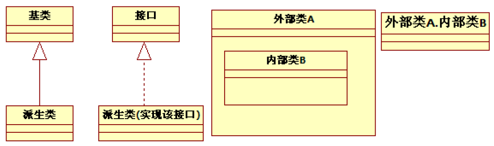
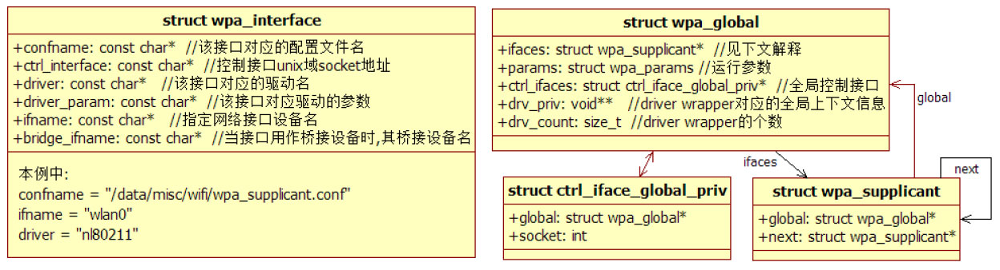

# 前言


中无法全部涵盖。为了方便读者进一步深入学习，本书每章的最后都会列举笔者在撰写各章时所阅读的参考资料。

以下是本书的内容概述。

❑第1章介绍本书的内容组成、使用的工具以及参考源码的下载方法。

❑第2章介绍Netd以及相关的背景知识。

❑第3章介绍Wi-Fi基础知识。Wi-Fi是本章的重点，而且也是当下最热门的技术。

❑第4章介绍wpa_supplicant，它是Wi-Fi领域中最核心的软件实现。

❑第5章介绍WifiService，它是Android平台中特有的Wi-Fi服务模块。

❑第6章和第7章介绍Wi-FiAlliance推出的两项重要技术——Wi-FiSimpleConfiguration和Wi-FiP2P，以及它们在Android平台中的代码实现。

❑第8章介绍NFC背景知识以及NFC在Android平台中的代码实现。NFC也是历史比较悠久的技术，希望它能随着Android的普及而走向大众。

❑第9章介绍GPS原理及Android平台中的位置管理服务架构。

❑附录为笔者和审稿专家之一的吴劲良先生关于本书定位、学习方法等方面的讨论。相信这些讨论内容能引起读者的共鸣。

本书通过理论和代码相结合的方式进行讲解，旨在引领读者一步步了解Wi-Fi、NFC和GPS模块的工作原理。总之，笔者希望读者在阅读完本书后能有以下收获。

❑初步掌握Wi-Fi、NFC和GPS的专业知识。

❑根据其实现代码，进一步加深对这些专业知识的理解。

读者对象适合阅读本书的读者包括：

❑Android系统开发工程师系统开发工程师常常需要深入理解系统的运转过程，而本书所涉及的内容正是他们在工作和学习中最想了解的。对具体模块感兴趣的读者也可单刀直入，阅读相关章节。

❑Wi-Fi、NFC或GPS的BSP开发工程师BSP开发工程师更需要对Android平台中这些模块的工作原理及背景知识有深入的理解。虽然本书没有介绍这些模块在LinuxKernel层的实现，但了解它们在用户空间的工作流程也将极大帮助BSP开发工程师拓展自己的知识面。

❑对Wi-Fi、NFC和GPS感兴趣的在校高年级本科生、研究生和其他读者在掌握理论的基础上，如何在实际代码中来实现或使用它们也许是众多学子最想知道的。希望这本理论与代码实现深度结合的书籍会助您一臂之力。

如何阅读本书本书是一本专业知识和代码实现相结合的书籍，所以读者在阅读时应注意以下事项。

❑首先阅读专业知识。如果对这些内容比较了解，可以直接跳转到代码实现。

❑然后是Android平台中相关模块的代码实现。这些代码实现往往基于一定的专业知识，所以在阅读代码时务必和前述的专业知识相结合。

❑每章最后都列出了笔者在撰写各章时所参考的资料。资料较多，读者可根据这些内容开展进一步的研究工作。

❑每章开头都把本章涉及的源码路径全部列出，而在具体分析源码时，只列出该源码的文件名及所分析的函数或相关数据结构名。例如：

[--＞AndroidRuntime.cpp：​：函数或数据结构名]

```cpp
//源码分析和一些注释
```

最后，本书在描述类之间的关系及函数调用流程上，使用了UML的静态类图及序列图。

UML是一个强大的工具，但它的建模规范过于烦琐，为更简单清晰地描述事情的本质，本书并未完全遵循UML的建模规范。如图1所示，外部类内部的方框用于表示内部类。另外，​“外部类A.内部类B”也用于表示内部类。接口和普通类用同一种框图表示。



图1类图图2所示为本书描述数据结构及成员时使用的UML图例。



图2数据结构图特别注意本书所使用的UML图都比较简单，读者不必花费大量时间专门学习UML。另外，出于方便考虑，本书所绘制的UML图没有严格遵守UML规范，这一点敬请读者谅解。

本书涉及的Android源码及一些开发工具的下载地址为hp://115.com/lb/5lbdugrdt4r。

关于它们的使用详情，请读者阅读1.3节。

勘误和支持由于作者的水平有限，加之编写时间仓促，书中难免会出现一些错误或不准确的地方，恳请读者不吝批评指正。若有问题，可通过邮箱或在博客上留言与笔者共同商讨。笔者的联系方式如下。

❑邮箱：fanping.deng@gmail.com❑博客：blog.csdn.net/innost和hp://my.oschina.net/innost/blog致谢首先要感谢杨福川编辑的大力支持。另外，要感谢本书审稿编辑白宇严谨负责的工作。

特别感谢Tieto公司。Tieto开放的企业文化、Android团队高效的工作效率、团队成员之间默契的工作配合程度，以及领导无私而有力的支持着实让我感到幸运和自豪。在Tieto就职的一年中，笔者所在的Android团队不仅成功赢得了客户的信任，更是得到了Tieto公司总部和其他国家分公司同事们的一致认可。同时，团队成员还积极分享，并在《程序员》杂志上发表了六篇高质量的文章。

在此，笔者借助本书对Tieto的领导和同事表示衷心的感谢。他们是中国北京分公司的Leo、hongbin、James、yantao、meiyang、dujiang、changgeng、caimin、wenjing、huaizhi、huirong、xinzhi、huimin、yuzheng、Liuxuan、Emily、Diego、jinghua、Jenny等，中国成都分公司的tianxiang、chengguo等，波兰分公司的Marcin、Marciej、FilipMatusiak等、捷克分公司的Vaclav、Bronislav、PetrousJan等、芬兰分公司的MikelEchegoyen。

当然，本书能得以快速出版，还需要感谢两位功力深厚并热心参与技术审稿的专家。他们是全志（Awinner）公司WirelessTeam负责人吴劲良，以及高通（Qualcomm）中国资深研发经理杨洋。二位专家在各自领域所表现出来的专业素养和技术水平，时刻提醒笔者应牢记“路漫漫其修远兮，吾将上下而求索”​。

另外，高通中国资深研发经理毛晓冬也对本书成功编写提供了帮助，在此一并表示感谢。

最后，感谢我的家人，尤其是我的妻子。希望明年上天能恩赐一个健康可爱的宝宝，这样，我将拥有更加无穷的动力编写更多书籍来回馈花费宝贵时间和精力关注本书的读者，以及所有在人生和职业道路上曾给予我指导的诸位师长。
